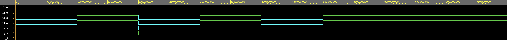

# 01-Gates

## 1. Link do Digital-Electronics-1 depozitáře

*Link do rootu depozitáře Digital-Electronics-1*

[The GitHub Link](https://github.com/christ-0ff/Digital-Electronics-1)

## 2. De Morganovy zákony:

### Zdrojový kód:
```
f_o  <= ((not b_i) and a_i) or ((not c_i) and (not b_i));
fnand_o <= not(not((not b_i) and a_i) and not((not c_i) and (not b_i)));
fnor_o <= not(b_i or (not a_i)) or not(c_i or b_i);
```
*Na funkci f aplikujeme De Morganovy zákony tak, aby se v nich vyskytoval pouze jeden typ operace. Takže buď operace OR nebo AND.*

### Obrázek:

*Všechny funkce by se měli rovnat stejně, a podle výsledků na obrázku se rovnají stejně.*

### Link: 
[The EDA-Playground Link](https://www.edaplayground.com/x/uq2V)

### Tabulka hodnot:
| **c** | **b** |**a** | **f(c,b,a)** |
| :-: | :-: | :-: | :-: |
| 0 | 0 | 0 | 1 |
| 0 | 0 | 1 | 1 |
| 0 | 1 | 0 | 0 |
| 0 | 1 | 1 | 0 |
| 1 | 0 | 0 | 0 |
| 1 | 0 | 1 | 1 |
| 1 | 1 | 0 | 0 |
| 1 | 1 | 1 | 0 |

*Výsledky pro všechny tři funkce by měli být stejné, a proto stačí vypsat pouze jeden sloupec výstupních hodnot.* 


## 3. Distributivní zákony:

### Zdrojový kód:
```
f1_o  <= (x_i and y_i) or (x_i and z_i) ;
f2_o  <= x_i and (y_i or z_i);
f3_o  <= (x_i or y_i) and (x_i or z_i);
f4_o  <= x_i or (y_i and z_i);
```
*Návzájem se rovnající distributivní funkce rozepíšeme do čtyř parciálních funkcí, a výsledky jedntlivých funkcí porovnáme.* 

### Obrázek:

*Musí platit f1 = f2, a f3 = f4. Což je podle obrázku splněno.*

### Link:
[The EDA-Playground Link](https://www.edaplayground.com/x/SaUt)
