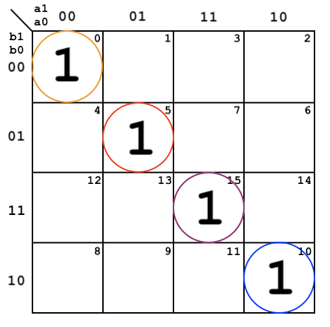
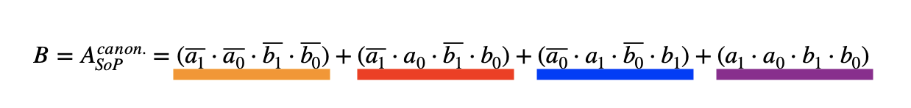
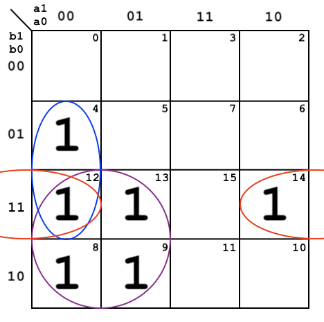
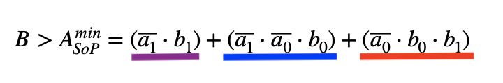
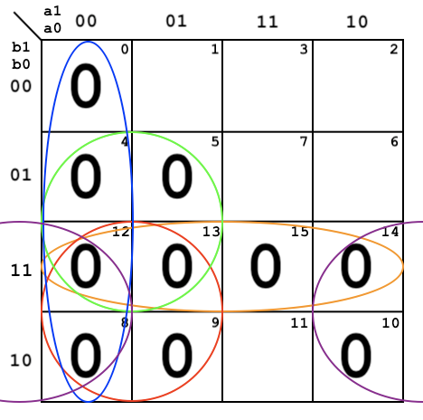
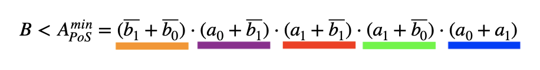
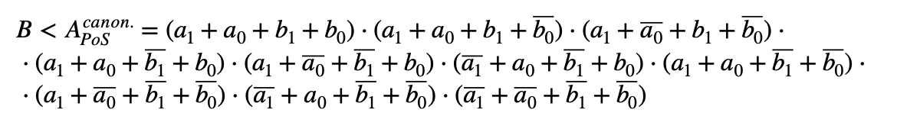

**Link to this page**
https://github.com/christ-0ff/Digital-Electronics-1/tree/main/Labs/02-logic
&nbsp;  
# 02-Logic


## 1. Truth table

**Completed 2-bit comparator truth table**

| **Dec. equivalent** | **B[1:0]** | **A[1:0]** | **B > A** | **B = A** | **B < A** |
| :-: | :-: | :-: | :-: | :-: | :-: |
| 0 | 0 0 | 0 0 | 0 | 1 | 0 |
| 1 | 0 0 | 0 1 | 0 | 0 | 1 |
| 2 | 0 0 | 1 0 | 0 | 0 | 1 |
| 3 | 0 0 | 1 1 | 0 | 0 | 1 |
| 4 | 0 1 | 0 0 | 1 | 0 | 0 |
| 5 | 0 1 | 0 1 | 0 | 1 | 0 |
| 6 | 0 1 | 1 0 | 0 | 0 | 1 |
| 7 | 0 1 | 1 1 | 0 | 0 | 1 |
| 8 | 1 0 | 0 0 | 1 | 0 | 0 |
| 9 | 1 0 | 0 1 | 1 | 0 | 0|
| 10 | 1 0 | 1 0 | 0 | 1 | 0 |
| 11 | 1 0 | 1 1 | 0 | 0 | 1 |
| 12 | 1 1 | 0 0 | 1 | 0 | 0 |
| 13 | 1 1 | 0 1 | 1 | 0 | 0 |
| 14 | 1 1 | 1 0 | 1 | 0 | 0 |
| 15 | 1 1 | 1 1 | 0 | 1 | 0 |


## 2. A 2-bit comparator

1. **B equals A**




  


2. **B is greater than A**




  


 3. **B is less than A**



**Diminished version**



**Canonical version**




 4. **Link for EDA Playground**

https://www.edaplayground.com/x/74HF


## 3. A 4-bit comparator:

1. **Design - Entity declaration & Architecture body** 

```vhdl
-- Entity declaration for 2-bit binary comparator

entity comparator_2bit is
    port(
        a_i             : in  std_logic_vector(4 - 1 downto 0);
        b_i             : in  std_logic_vector(4 - 1 downto 0);
        --
        B_greater_A_o   : out std_logic;
        B_equals_A_o    : out std_logic;
        B_less_A_o      : out std_logic       
    );
end entity comparator_2bit;


-- Architecture body for 2-bit binary comparator

architecture Behavioral of comparator_2bit is
begin

    B_greater_A_o  <= '1' when (b_i > a_i) else '0';
    B_equals_A_o   <= '1' when (b_i = a_i) else '0';
    B_less_A_o     <= '1' when (b_i < a_i) else '0';

end architecture Behavioral;
```


2. **Stimulus process from testbench file**  

```vhdl
-- Architecture body for testbench

architecture testbench of tb_comparator_2bit is

    -- Local signals
    signal s_a       : std_logic_vector(4 - 1 downto 0);
    signal s_b       : std_logic_vector(4 - 1 downto 0);
    signal s_B_greater_A : std_logic;
    signal s_B_equals_A  : std_logic;
    signal s_B_less_A    : std_logic;

begin
    -- Connecting testbench signals with comparator_2bit entity (Unit Under Test)
    uut_comparator_2bit : entity work.comparator_2bit
        port map(
            a_i           => s_a,
            b_i           => s_b,
            B_greater_A_o => s_B_greater_A,
            B_equals_A_o  => s_B_equals_A,
            B_less_A_o    => s_B_less_A
        );

    --------------------------------------------------------------------
    -- Data generation process
    --------------------------------------------------------------------
    p_stimulus : process
    begin
        -- Report a note at the begining of stimulus process
        report "Stimulus process started" severity note;


        -- 1st test values
        s_b <= "0000"; s_a <= "0000"; wait for 100 ns;
        -- Expected output
        assert ((s_B_greater_A = '0') and (s_B_equals_A = '1') and (s_B_less_A = '0'))
        -- If false, then report an error
        report "Test failed for input combination: 0000, 0000" severity error;
                
        --I've skipped other values to save some space...
        
        -- Error test values
        s_b <= "0011"; s_a <= "0011"; wait for 100 ns;
        -- Expected output
        assert ((s_B_greater_A = '0') and (s_B_equals_A = '0') and (s_B_less_A = '1'))
        -- If false, then report an error
        report "Test failed for input combination: 0011, 0011" severity error;
        
        -- Report a note at the end of stimulus process
        report "Stimulus process finished" severity note;
        wait;
        
    end process p_stimulus;

end architecture testbench;
```


 3. **Simulator console output**

```console
analyze design.vhd
analyze testbench.vhd
elaborate tb_comparator_2bit
testbench.vhd:45:9:@0ms:(report note): Stimulus process started
testbench.vhd:123:9:@1100ns:(assertion error): Test failed for input combination: 0011, 0011
testbench.vhd:129:9:@1100ns:(report note): Stimulus process finished
Finding VCD file...
./dump.vcd
``` 


4. **EDA Playground link**

https://www.edaplayground.com/x/p84g
