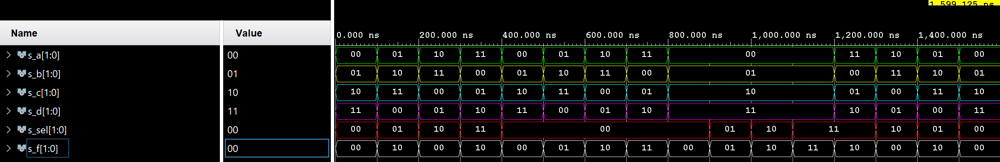

# 03-Vivado


## 1. Connections of LEDs and switches to pins
```
Switches:                                    LEDs:
Switch 00 => J15                             LED 00 => H17
Switch 01 => L16                             LED 01 => K15
Switch 02 => M13                             LED 02 => J13
Switch 03 => R15                             LED 03 => N14
Switch 04 => R17                             LED 04 => R18
Switch 05 => T18                             LED 05 => V17
Switch 06 => U18                             LED 06 => U17
Switch 07 => R13                             LED 07 => U16
Switch 08 => T8                              LED 08 => V16
Switch 09 => U8                              LED 09 => T15
Switch 10 => R16                             LED 10 => U14
Switch 11 => T13                             LED 11 => T16
Switch 12 => H6                              LED 12 => V15
Switch 13 => U12                             LED 13 => V14
Switch 14 => U11                             LED 14 => V12
Switch 15 => V10                             LED 15 => V11
```


## 2. Two-bit wide 4-to-1 multiplexer.

**VHDL Architecture of mux_2bit_4to1**
```vhdl
architecture Behavioral of mux_2bit_4to1 is
begin

       f_o  <= a_i when (sel_i = "00") else
               b_i when (sel_i = "01") else
               c_i when (sel_i = "10") else
               d_i;

end architecture Behavioral;
```

**VHDL Stimulus process from testbench**
```vhdl
p_stimulus : process
begin
    -- Report a note at the begining of stimulus process
    report "Stimulus process started" severity note;

            s_a <= "00"; s_b <= "01"; s_c <= "10"; s_d <= "11"; 
            s_sel <= "00";
    wait for 100 ns;
   
            s_a <= "01"; s_b <= "10"; s_c <= "11"; s_d <= "00"; 
            s_sel <= "01";
    wait for 100 ns;
    
            s_a <= "10"; s_b <= "11"; s_c <= "00"; s_d <= "01";
            s_sel <= "10";
    wait for 100 ns;
    
            s_a <= "11"; s_b <= "00"; s_c <= "01"; s_d <= "10";
            s_sel <= "11";
    wait for 100 ns;
    
            s_a <= "00"; s_b <= "01"; s_c <= "10"; s_d <= "11"; 
            s_sel <= "00";
    wait for 100 ns;
   
            s_a <= "01"; s_b <= "10"; s_c <= "11"; s_d <= "00"; 
            s_sel <= "01";
    wait for 100 ns;
    
            s_a <= "10"; s_b <= "11"; s_c <= "00"; s_d <= "01";
            s_sel <= "10";
    wait for 100 ns;
    
            s_a <= "11"; s_b <= "00"; s_c <= "01"; s_d <= "10";
            s_sel <= "11";
    wait for 100 ns;
    
            s_a <= "00"; s_b <= "01"; s_c <= "10"; s_d <= "11"; 
            s_sel <= "00";
    wait for 100 ns;
   
            s_a <= "01"; s_b <= "10"; s_c <= "11"; s_d <= "00"; 
            s_sel <= "01";
    wait for 100 ns;
    
            s_a <= "10"; s_b <= "11"; s_c <= "00"; s_d <= "01";
            s_sel <= "10";
    wait for 100 ns;
    
            s_a <= "11"; s_b <= "00"; s_c <= "01"; s_d <= "10";
            s_sel <= "11";
    wait for 100 ns;
    
            s_a <= "00"; s_b <= "01"; s_c <= "10"; s_d <= "11"; 
            s_sel <= "00";
    wait for 100 ns;
   
            s_a <= "01"; s_b <= "10"; s_c <= "11"; s_d <= "00"; 
            s_sel <= "01";
    wait for 100 ns;
    
            s_a <= "10"; s_b <= "11"; s_c <= "00"; s_d <= "01";
            s_sel <= "10";
    wait for 100 ns;
    
            s_a <= "11"; s_b <= "00"; s_c <= "01"; s_d <= "10";
            s_sel <= "11";
    wait for 100 ns;   
      
    -- Report a note at the end of stimulus process
    report "Stimulus process finished" severity note;
    wait;
end process p_stimulus;
```
**Image of waveforms**



## 3. Vivado tutorial

**Project creation**

#### 1. *First step:*
#### 
#### 2. *Naming project:*

#### 3. *Project type selection:*

#### 4. *We can skip this step and add source files later.*
 
 #### 5. *We can skip this step and add constraints files later.*
 
 #### 6. *Finishing:*
 
 #### 7. *On this summary page just click on **Finish** button*:

**Adding source files**


**Adding testbench files**

**Running simulation**

**Adding XDC constraints files**

