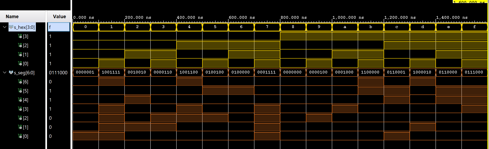
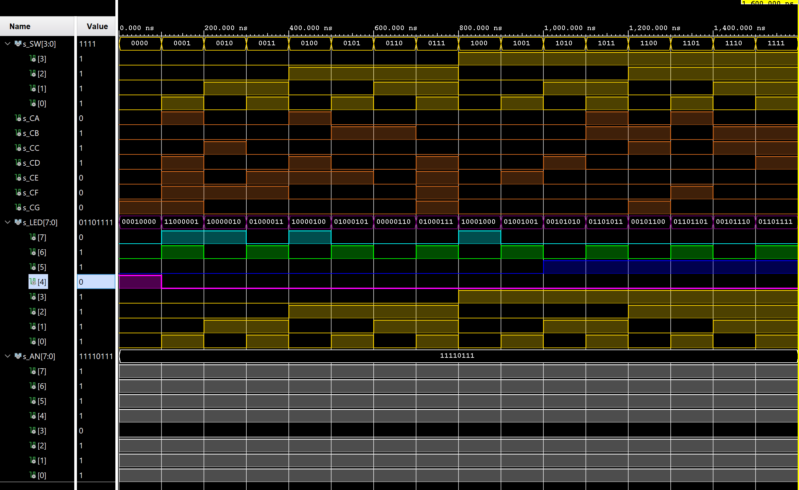

# 04-Segment


## 1. Truth table  & Connections on board

### Connection of 7-segment display on Nexus board

```table
AN0 => J17                     CA => T10
AN1 => J18                     CB => R10
AN2 => T9                      CC => K16
AN3 => J14                     CD => K13
AN4 => P14                     CE => P15
AN5 => T14                     CF => T11
AN6 => K2                      CG => L18
AN7 => U13                     DP => H15
```

### Truth table for common anode 7-segment display

| **Hex** | **Inputs** | **A** | **B** | **C** | **D** | **E** | **F** | **G** |
| :-: | :-: | :-: | :-: | :-: | :-: | :-: | :-: | :-: |
| 0 | 0000 | 0 | 0 | 0 | 0 | 0 | 0 | 1 |
| 1 | 0001 | 1 | 0 | 0 | 1 | 1 | 1 | 1 |
| 2 | 0010 | 0 | 0 | 1 | 0 | 0 | 1 | 0 |
| 3 | 0011 | 0 | 0 | 0 | 0 | 1 | 1 | 0 |
| 4 | 0100 | 1 | 0 | 0 | 1 | 1 | 0 | 0 |
| 5 | 0101 | 0 | 1 | 0 | 0 | 1 | 0 | 0 |
| 6 | 0110 | 0 | 1 | 0 | 0 | 0 | 0 | 0 |
| 7 | 0111 | 0 | 0 | 0 | 1 | 1 | 1 | 1 |
| 8 | 1000 | 0 | 0 | 0 | 0 | 0 | 0 | 0 |
| 9 | 1001 | 0 | 0 | 0 | 0 | 1 | 0 | 0 |
| A | 1010 | 0 | 0 | 0 | 1 | 0 | 0 | 0 |
| b | 1011 | 1 | 1 | 0 | 0 | 0 | 0 | 0 |
| C | 1100 | 0 | 1 | 1 | 0 | 0 | 0 | 1 |
| d | 1101 | 1 | 0 | 0 | 0 | 0 | 1 | 0 |
| E | 1110 | 0 | 1 | 1 | 0 | 0 | 0 | 0 |
| F | 1111 | 0 | 1 | 1 | 1 | 0 | 0 | 0 |

## 2. Seven-segment display decoder

### VHDL Architecture form source file hex_7seg.vhd
```vhdl
architecture Behavioral of hex_7seg is
begin
    --------------------------------------------------------------------
    -- p_7seg_decoder:
    -- A combinational process for 7-segment display (Common Anode)
    -- decoder. Any time "hex_i" is changed, the process is "executed".
    -- Output pin seg_o(6) controls segment A, seg_o(5) segment B, etc.
    --       segment A
    --        | segment B
    --        |  | segment C
    --        |  |  |   ...   segment G
    --        +-+|+-+          |
    --          |||            |
    -- seg_o = "0000001"-------+
    --------------------------------------------------------------------
    p_7seg_decoder : process(hex_i)
    begin
        case hex_i is
        
            when "0000" =>
                seg_o <= "0000001";     -- 0              
            when "0001" =>
                seg_o <= "1001111";     -- 1               
            when "0010" =>
                seg_o <= "0010010";     -- 2                   
            when "0011" =>
                seg_o <= "0000110";     -- 3               
            when "0100" =>
                seg_o <= "1001100";     -- 4                    
            when "0101" =>
                seg_o <= "0100100";     -- 5               
            when "0110" =>
                seg_o <= "0100000";     -- 6               
            when "0111" =>
                seg_o <= "0001111";     -- 7
            when "1000" =>
                seg_o <= "0000000";     -- 8    
            when "1001" =>
                seg_o <= "0000100";     -- 9
            when "1010" =>
                seg_o <= "0001000";     -- A    
            when "1011" =>
                seg_o <= "1100000";     -- b
            when "1100" =>
                seg_o <= "0110001";     -- C    
            when "1101" =>
                seg_o <= "1000010";     -- d
            when "1110" =>
                seg_o <= "0110000";     -- E
            when others =>
                seg_o <= "0111000";     -- F
                
        end case;
    end process p_7seg_decoder;

end Behavioral;
```

### VHDL Stimulus process from testhench file tb_hex_7seg.vhd
```vhdl
p_stimulus : process 
    begin
        report "Stimulus process started" severity note;
        
            s_hex <= "0000"; wait for 100ns;
            s_hex <= "0001"; wait for 100ns;
            s_hex <= "0010"; wait for 100ns;
            s_hex <= "0011"; wait for 100ns;
            s_hex <= "0100"; wait for 100ns;
            s_hex <= "0101"; wait for 100ns;
            s_hex <= "0110"; wait for 100ns;
            s_hex <= "0111"; wait for 100ns;
            s_hex <= "1000"; wait for 100ns;
            s_hex <= "1001"; wait for 100ns;
            s_hex <= "1010"; wait for 100ns;
            s_hex <= "1011"; wait for 100ns;
            s_hex <= "1100"; wait for 100ns;
            s_hex <= "1101"; wait for 100ns;
            s_hex <= "1110"; wait for 100ns;
            s_hex <= "1111"; wait for 100ns;

        report "Stimulus process finished" severity note;
    wait;

end process p_stimulus;
```

### Screenshot of simulated waveforms


### VHDL Code from source file top.vhd
with 7-segment module instantiation.

```vhdl
-- The code:


-- The Libraries:

library IEEE;
use IEEE.STD_LOGIC_1164.ALL;


-- Entity declaration:

entity top is
    Port 
    (
     SW  : in  STD_LOGIC_VECTOR (4 - 1 downto 0);   --Input Binary
     --    
     CA  : out STD_LOGIC;
     CB  : out STD_LOGIC;
     CC  : out STD_LOGIC;
     CD  : out STD_LOGIC;
     CE  : out STD_LOGIC;
     CF  : out STD_LOGIC;
     CG  : out STD_LOGIC;
     
     LED : out STD_LOGIC_VECTOR (8 - 1 downto 0);   -- LED indicators
     AN  : out STD_LOGIC_VECTOR (8 - 1 downto 0)    -- Common anode signals to individual displays
     );
end top;

-- Architecture:

architecture Behavioral of top is
begin
    --------------------------------------------------------------------
    -- Instance (copy) of hex_7seg entity
    hex2seg : entity work.hex_7seg
        port map
        (
            hex_i    => SW,           
            --
            seg_o(6) => CA,
            seg_o(5) => CB,
            seg_o(4) => CC,
            seg_o(3) => CD,
            seg_o(2) => CE,
            seg_o(1) => CF,
            seg_o(0) => CG
        );

    -- Connect one common anode to 3.3V
    AN <= b"1111_0111";

    -- Display input value
    LED(4 - 1 downto 0) <= SW;

    -- Turn LED(4) on if input value is equal to 0, ie "0000"
    LED(4) <= '1' when (SW = "0000") else '0';
    
    -- Turn LED(5) on if input value is greater than "1001"
    LED(5) <= '1' when (SW > "1001") else '0';
    
    -- Turn LED(6) on if input value is odd, ie 1, 3, 5, ...
    LED(6) <= SW(0);
    
    -- Turn LED(7) on if input value is a power of two, ie 1, 2, 4, or 8
    LED(7)  <= '1' when (SW = "0001") else
               '1' when (SW = "0010") else
               '1' when (SW = "0100") else
               '1' when (SW = "1000") else
               '0';
               
end Behavioral;
```

## LED (7:4) indicators.

### Truth table and VHDL Code

**Truth table**

| **Hex** | **Inputs** | **LED4** | **LED5** | **LED6** | **LED7** |
| :-: | :-: | :-: | :-: | :-: | :-: |
| 0 | 0000 | 1 | 0 | 0 | 0 |
| 1 | 0001 | 0 | 0 | 1 | 1 |
| 2 | 0010 | 0 | 0 | 0 | 1 |
| 3 | 0011 | 0 | 0 | 1 | 0 |
| 4 | 0100 | 0 | 0 | 0 | 1 |
| 5 | 0101 | 0 | 0 | 1 | 0 |
| 6 | 0110 | 0 | 0 | 0 | 0 |
| 7 | 0111 | 0 | 0 | 1 | 0 |
| 8 | 1000 | 0 | 0 | 0 | 1 |
| 9 | 1001 | 0 | 0 | 1 | 0 |
| A | 1010 | 0 | 1 | 0 | 0 |
| b | 1011 | 0 | 1 | 1 | 0 |
| C | 1100 | 0 | 1 | 0 | 0 |
| d | 1101 | 0 | 1 | 1 | 0 |
| E | 1110 | 0 | 1 | 0 | 0 |
| F | 1111 | 0 | 1 | 1 | 0 |

**VHDL Code for LEDs(7:4)**
```vhdl
-- Display input value
LED(4 - 1 downto 0) <= SW;

-- Turn LED(4) on if input value is equal to 0, ie "0000"
LED(4) <= '1' when (SW = "0000") else '0';

-- Turn LED(5) on if input value is greater than "1001"
LED(5) <= '1' when (SW > "1001") else '0';

-- Turn LED(6) on if input value is odd, ie 1, 3, 5, ...
LED(6) <= SW(0);

-- Turn LED(7) on if input value is a power of two, ie 1, 2, 4, or 8
LED(7)  <= '1' when (SW = "0001") else
           '1' when (SW = "0010") else
           '1' when (SW = "0100") else
           '1' when (SW = "1000") else
           '0';
           
           
-- Next "same" processes are working too...
--I just wanted to make copy of them on github that is more accessible than Vivado projects.    

--    -- Turn LED(7) on if input value is a power of two, ie 1, 2, 4, or 8               
--    p_led7 : process (SW)
--    begin
--        case SW is
--            when "0001" =>
--                LED(7) <= '1';     -- 1
--            when "0010" =>
--                LED(7) <= '1';     -- 2
--            when "0100" =>
--                LED(7) <= '1';     -- 4
--            when "1000" =>
--                LED(7) <= '1';     -- 8
--            when others =>
--                LED(7) <= '0';     
--        end case;
--    end process p_led7;

--    -- Turn LED(7) on if input value is a power of two, ie 1, 2, 4, or 8    
--   p_led7_2 : process (SW)
--   begin
--       if    (SW = "0001") then
--           LED(7) <= '1';
--       elsif (SW = "0010") then
--           LED(7) <= '1';
--       elsif (SW = "0100") then
--           LED(7) <= '1';
--       elsif (SW = "1000") then
--           LED(7) <= '1';  
--       else
--           LED(7) <= '0';         
--       end if;
--   end process p_led7_2;
```

### Screenshot of simulated time waveforms



