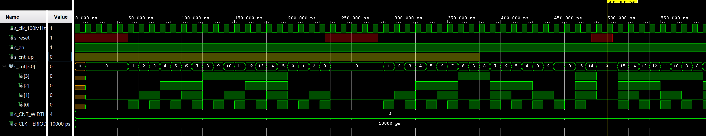
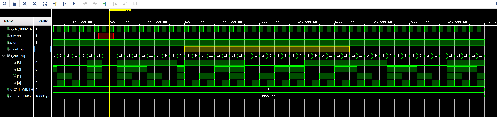
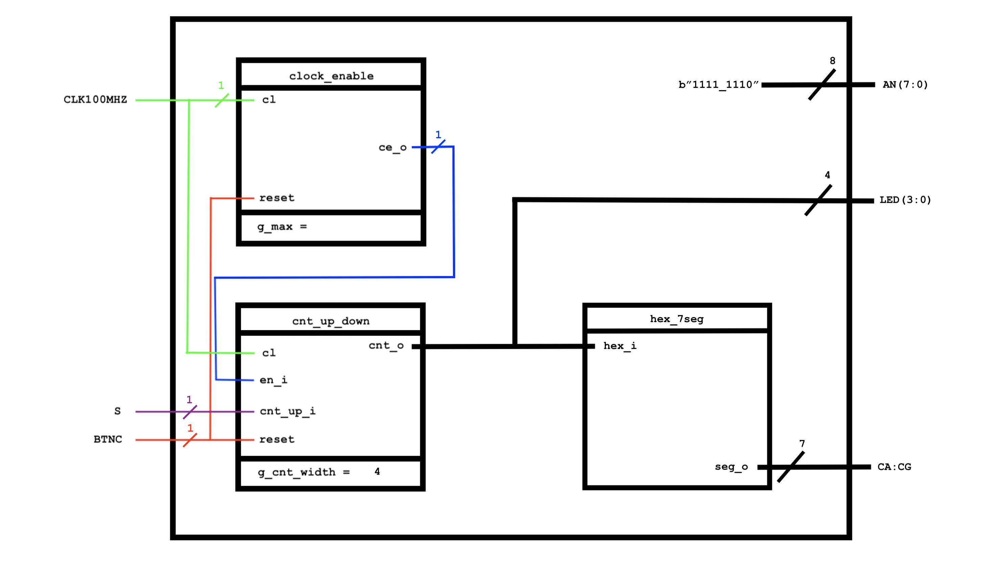
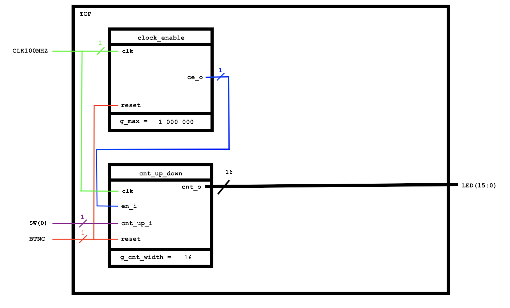

# 05-Counter


## 1. Connections of pins & Table with values
### Pin connections

*Buttons are connected to 3.3V DC signal. When not pushed they generate a low output, and when pressed, they generate high output value. So connections are active-high.*
```table
5 Buttons to 5 pins board connection:
BTNL => P17
BTNR => M17
BTNU => M18
BTND => P18
BTNC => N17
```

### Table with calculated values
   | **Time interval** | **Number of clk periods** | **Number of clk periods in hex** | **Number of clk periods in binary** |
   | :-: | :-: | :-: | :-: |
   | 2&nbsp;ms | 200 000 | `x"3_0d40"` | `b"0011_0000_1101_0100_0000"` |
   | 4&nbsp;ms | 400 000 | `x"6_1A80"` | `b"0110_0001_1010_1000_0000"` |
   | 10&nbsp;ms | 1 000 000 | `x"F_4240"` | `b"1111_0100_0010_0100_0000"` |
   | 250&nbsp;ms | 25 000 000 | `x"17D_7840"` | `b"0001_0111_1101_0111_1000_0100_0000"` |  
   | 500&nbsp;ms | 50 000 000 | `x"2FA_F080"` | `b"0010_1111_1010_1111_0000_1000_0000"` |
   | 1&nbsp;sec | 100 000 000 | `x"5F5_E100"` | `b"0101_1111_0101_1110_0001_0000_0000"` |


## 2. Bidirectional counter

### VHDL code of the process p_cnt_up_down
```vhdl
p_cnt_up_down : process(clk)
begin
     if rising_edge(clk) then
     
         if (reset = '1') then               -- Synchronous reset
             s_cnt_local <= (others => '0'); -- Clear all bits

         elsif (en_i = '1') then       -- Test if counter is enabled

              if (cnt_up_i = '1') then
                  s_cnt_local <= s_cnt_local + 1;
              else
                  s_cnt_local <= s_cnt_local - 1;
              end if;   
             
         end if;
         
     end if;
 end process p_cnt_up_down;
```

### VHDL reset and stimulus processes from testbench file tb_cnt_up_down.vhd
```vhdl
--------------------------------------------------------------------
-- Reset generation process
--------------------------------------------------------------------
p_reset_gen : process
begin
    s_reset <= '1';
    wait for 50 ns;
    
    -- Reset desactivated
    s_reset <= '0';
    wait for 185 ns;
    
    s_reset <= '1';
    wait for 50 ns;
    
    s_reset <= '0';
    wait for 200 ns;
    
    s_reset <= '1';
    wait for 20 ns;

    s_reset <= '0';
    wait;
end process p_reset_gen;

--------------------------------------------------------------------
-- Data generation process
--------------------------------------------------------------------
p_stimulus : process
begin
    report "Stimulus process started" severity note;

    -- Enable counting
    s_en     <= '1';
    
    -- Change counter direction
    s_cnt_up <= '1';
    wait for 380 ns;
    s_cnt_up <= '0';
    wait for 220 ns;
    
    s_cnt_up <= '1';
    wait for 220 ns;
    s_cnt_up <= '0';
    wait for 380 ns;


    -- Disable counting
    s_en     <= '0';

    report "Stimulus process finished" severity note;
    wait;
end process p_stimulus;
```

### Simulation screenshots



## 3. Top level
### VHDL code from source file top.vhd...
**...with all instantiations for the 4-bit bidirectional counter.**
```vhdl
--The Librearies:
library IEEE;
use IEEE.STD_LOGIC_1164.ALL;

--The Entities:
entity top is
    Port ( 
           CLK100MHZ : in STD_LOGIC;
           BTNC      : in STD_LOGIC;
           SW        : in STD_LOGIC_VECTOR (1 - 1 downto 0);
           --
--           LED       : out STD_LOGIC_VECTOR (4 - 1 downto 0);
           LED1      : out STD_LOGIC_VECTOR (16 - 1 downto 0);
           CA        : out STD_LOGIC;
           CB        : out STD_LOGIC;
           CC        : out STD_LOGIC;
           CD        : out STD_LOGIC;
           CE        : out STD_LOGIC;
           CF        : out STD_LOGIC;
           CG        : out STD_LOGIC;
           AN        : out STD_LOGIC_VECTOR (8 - 1 downto 0));
end top;

------------------------------------------------------------------------
-- Architecture body for top level
------------------------------------------------------------------------
architecture Behavioral of top is

    -- Internal clock enable
    signal s_en  : std_logic;
    -- Internal counter
    signal s_cnt  : std_logic_vector(4 - 1 downto 0);
    signal s_cnt1 : std_logic_vector(16 - 1 downto 0);

begin
    --4-bit counter to 7-segment and 4 LEDs
    --------------------------------------------------------------------
    -- Instance (copy) of clock_enable entity
    clk_en0 : entity work.clock_enable
        generic map(
            g_MAX => 100000000
        )
        port map(
            clk   => CLK100MHZ,
            reset => BTNC,
            ce_o  => s_en
        );

    --------------------------------------------------------------------
    -- Instance (copy) of cnt_up_down entity
    bin_cnt0 : entity work.cnt_up_down
        generic map(
            g_CNT_WIDTH => 4
        )
        port map(
            clk      => CLK100MHZ,
            reset    => BTNC,
            en_i     => s_en,
            cnt_up_i => SW(0),
            cnt_o    => s_cnt
        );          

    -- Display input value on LEDs
--    LED(3 downto 0) <= s_cnt;
    

    --------------------------------------------------------------------
    -- Instance (copy) of hex_7seg entity
    hex2seg : entity work.hex_7seg
        port map(
            hex_i    => s_cnt,
            seg_o(6) => CA,
            seg_o(5) => CB,
            seg_o(4) => CC,
            seg_o(3) => CD,
            seg_o(2) => CE,
            seg_o(1) => CF,
            seg_o(0) => CG
        );

    -- Connect one common anode to 3.3V
    AN <= b"1111_1110";
    
    --16-bit counter to LEDs
    --------------------------------------------------------------------
    -- Instance (copy) of clock_enable entity
    clk_en1 : entity work.clock_enable
        generic map(
            g_MAX => 1000000
        )
        port map(
            clk   => CLK100MHZ,
            reset => BTNC,
            ce_o  => s_en
        );

    --------------------------------------------------------------------
    -- Instance (copy) of cnt_up_down entity
    bin_cnt1 : entity work.cnt_up_down
        generic map(
            g_CNT_WIDTH => 16
        )
        port map(
            clk      => CLK100MHZ,
            reset    => BTNC,
            en_i     => s_en,
            cnt_up_i => SW(0),
            cnt_o    => s_cnt1
        );          

    -- Display input value on LEDs
    LED1(16 - 1 downto 0) <= s_cnt1;
 

end architecture Behavioral;
```
### Sketches of Top layers
**4-bit bidirectional counter**

*Time base is set to the value that is in the code. So is the bit width.*



**16-bit bidirectional counter with a 10 ms time base**

*We don't need an entity `hex_7seg`, because we connect an output from the `cnt_up_down` to the `LEDs(15:0)`. Also we do not need to assign a value to the `AN` output to switch on one digit of the 7-segment display.*


