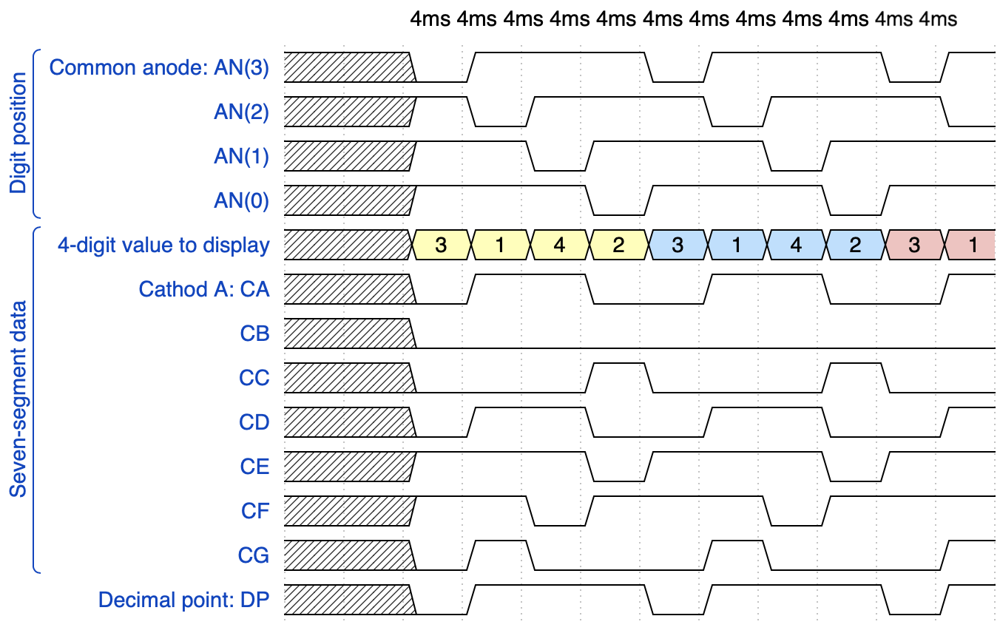
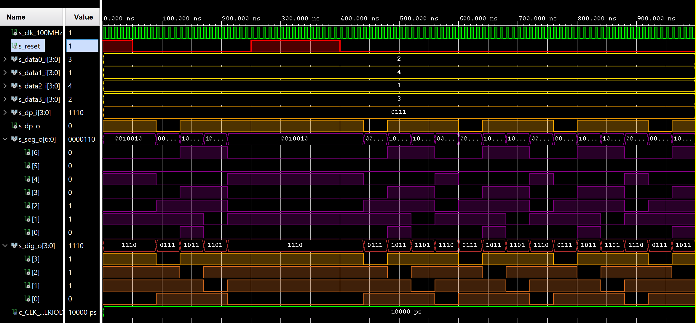
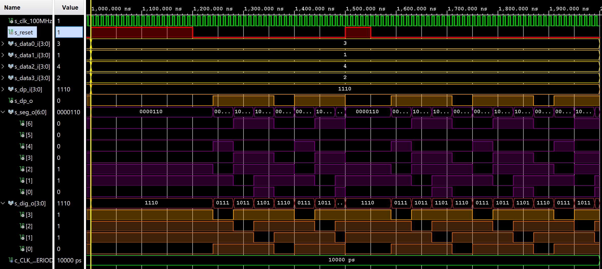
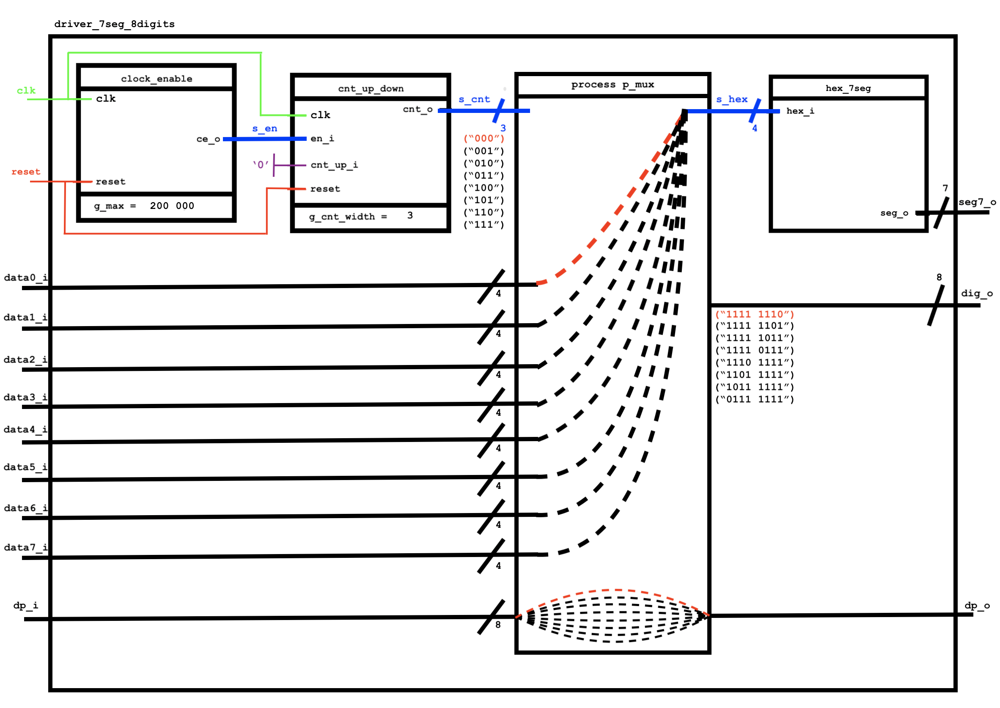

# 06-Display Driver


## 1. Timing diagram figure for displaying value `3.142`




## 2. Display driver

### Listing of VHDL code of the process `p_mux`
```vhdl
p_mux : process(s_cnt, data0_i, data1_i, data2_i, data3_i, dp_i)
begin
    case s_cnt is
        when "11" =>
            s_hex <= data3_i;
            dp_o  <= dp_i(3);
            dig_o <= "0111";

        when "10" =>
            s_hex <= data2_i;
            dp_o  <= dp_i(2);
            dig_o <= "1011";

        when "01" =>
            s_hex <= data1_i;
            dp_o  <= dp_i(1);
            dig_o <= "1101";

        when others =>
            s_hex <= data0_i;
            dp_o  <= dp_i(0);
            dig_o <= "1110";
    end case;
end process p_mux;
```

### Listing of VHDL testbench file `tb_driver_7seg_4digits`
```vhdl
------------------------------------------------------------------------
--
-- Template for 4-digit 7-segment display driver testbench.
-- Nexys A7-50T, Vivado v2020.1.1, EDA Playground
--
-- Copyright (c) 2020 Tomas Fryza
-- Dept. of Radio Electronics, Brno University of Technology, Czechia
-- This work is licensed under the terms of the MIT license.
--
------------------------------------------------------------------------

library ieee;
use ieee.std_logic_1164.all;

------------------------------------------------------------------------
-- Entity declaration for testbench
------------------------------------------------------------------------
entity tb_driver_7seg_4digits is
    -- Entity of testbench is always empty
end entity tb_driver_7seg_4digits;

------------------------------------------------------------------------
-- Architecture body for testbench
------------------------------------------------------------------------
architecture testbench of tb_driver_7seg_4digits is

    -- Local constants
    constant c_CLK_100MHZ_PERIOD : time    := 10 ns;

    --Local signals
    signal s_clk_100MHz : std_logic;
   -- signal s_clk        : std_logic;        -- Main clock       
    signal s_reset      : std_logic;        -- Synchronous reset
 -- 4-bit input values for individual digits         
    signal s_data0_i    : std_logic_vector(4 - 1 downto 0);     
    signal s_data1_i    : std_logic_vector(4 - 1 downto 0);     
    signal s_data2_i    : std_logic_vector(4 - 1 downto 0);     
    signal s_data3_i    : std_logic_vector(4 - 1 downto 0);     
 -- 4-bit input value for decimal points             
    signal s_dp_i       : std_logic_vector(4 - 1 downto 0);     
 -- Decimal point for specific digit                 
    signal s_dp_o       : std_logic;                            
 -- Cathode values for individual segments           
    signal s_seg_o      : std_logic_vector(7 - 1 downto 0);     
 -- Common anode signals to individual displays      
    signal s_dig_o      : std_logic_vector(4 - 1 downto 0);      

begin
    -- Connecting testbench signals with driver_7seg_4digits entity
    -- (Unit Under Test)
    uut_driver_7seg_4digits  : entity work.driver_7seg_4digits
        port map
        (    
        clk     => s_clk_100MHz,                    
        reset   => s_reset,     
                
        data0_i => s_data0_i,  
        data1_i => s_data1_i,  
        data2_i => s_data2_i,  
        data3_i => s_data3_i,   

        dp_i    => s_dp_i,     
        dp_o    => s_dp_o,     
        seg_o   => s_seg_o,    
        dig_o   => s_dig_o   
        );
    --------------------------------------------------------------------
    -- Clock generation process
    --------------------------------------------------------------------
    p_clk_gen : process
    begin
        while now < 2000 ns loop         -- 75 periods of 100MHz clock
            s_clk_100MHz <= '1';
            wait for c_CLK_100MHZ_PERIOD / 2;
            s_clk_100MHz <= '0';
            wait for c_CLK_100MHZ_PERIOD / 2;
        end loop;
        wait;
    end process p_clk_gen;

    --------------------------------------------------------------------
    -- Reset generation process
    --------------------------------------------------------------------
    p_reset : process 
    begin      
         s_reset <= '1';
         wait for 50ns;
         
         s_reset <= '0';
         wait for 200ns;   
         
        s_reset <= '1';
        wait for 150ns; 
        
        s_reset <= '0';
         wait for 600ns;   

        s_reset <= '1';
        wait for 200ns;   
       
        s_reset <= '0';
        wait for 300ns; 
         
        s_reset <= '1';
        wait for 50ns; 
         
        s_reset <= '0';
    wait;
    end process p_reset;
    
    --------------------------------------------------------------------
    -- Data generation process                                         
    --------------------------------------------------------------------    
    p_stimulus : process 
    begin
        report "Stimulus process started" severity note;
        
         s_data0_i <= "0010";
         s_data1_i <= "0100";
         s_data2_i <= "0001";
         s_data3_i <= "0011";
         s_dp_i <= "0111";
         wait for 900ns;
         
        -- Expected output
        assert ((s_dp_o = '1') or (s_dig_o = "0111") or (s_seg_o = "0010010"))
        -- If false, then report an error
        report "Test failed for input combination: 0111, 0010010" severity error;
        wait for 100ns;
------------------------------------------------------------------------------
        s_data0_i <= "0011";
        s_data1_i <= "0001";
        s_data2_i <= "0100";
        s_data3_i <= "0010";
        s_dp_i <= "1110";
        wait for 900ns;
         
        -- Expected output
        assert ((s_dp_o = '0') or (s_dig_o = "1110") or (s_seg_o = "0000110"))
        -- If false, then report an error
        report "Test failed for input combination: 1110, 0000110" severity error;
        wait for 100ns;
      
         
        report "Stimulus process finished" severity note;
    wait;
    end process p_stimulus;

end architecture testbench;
```

### Screenshot with simulated time waveforms

**The `3.142` number**



**Test values**



### Listing of VHDL architecture of the top layer
```vhdl
architecture Behavioral of top is
    -- No internal signals
begin

    --------------------------------------------------------------------
    -- Instance (copy) of driver_7seg_4digits entity
    driver_seg_4 : entity work.driver_7seg_4digits
        port map(
            clk        => CLK100MHZ,
            reset      => BTNC,
                         
            data0_i(3) => SW(3),
            data0_i(2) => SW(2),
            data0_i(1) => SW(1),
            data0_i(0) => SW(0),
            
            data1_i(3) => SW(7),
            data1_i(2) => SW(6),
            data1_i(1) => SW(5),
            data1_i(0) => SW(4),
            
            data2_i(3) => SW(11),
            data2_i(2) => SW(10),
            data2_i(1) => SW(9),
            data2_i(0) => SW(8),
            
            data3_i(3) => SW(15),
            data3_i(2) => SW(14),
            data3_i(1) => SW(13),
            data3_i(0) => SW(12),
            
            seg_o(0)   => CA,
            seg_o(1)   => CB,
            seg_o(2)   => CC,
            seg_o(3)   => CD,
            seg_o(4)   => CE,
            seg_o(5)   => CF,
            seg_o(6)   => CG,
            dp_o       => DP,
            dig_o      => AN(3 downto 0),  
                      
            dp_i => "0111"
        );

    -- Disconnect the top four digits of the 7-segment display
    AN(7 downto 4) <= b"1111";

end architecture Behavioral;
```


## 3. Eight-digit driver


