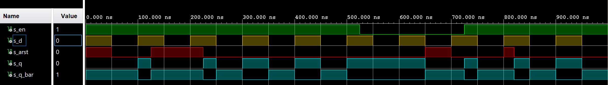
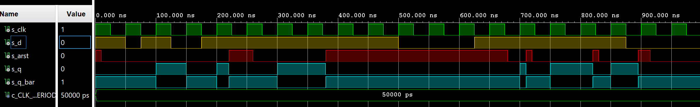
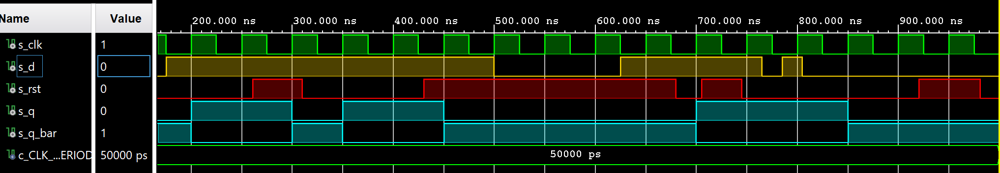
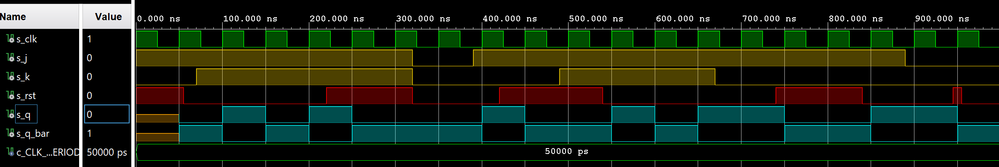
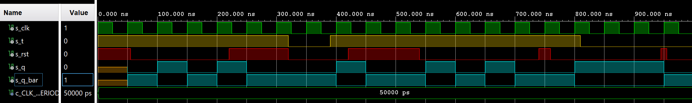

# 7-Latches and Flip-flops

## 1. Characteristic equations and tables for flip-flops.

### Tables of D, JK, T flip-flops and characteristic equations

**D flip-flop**

   | **D** | **Qn** | **Q(n+1)** | **Comments** |
   | :-: | :-: | :-: | :-- |
   | 0 | 0 | 0 | No Change |
   | 0 | 1 | 0 | Reset |
   | 1 | 0 | 1 | Set |
   | 1 | 1 | 1 | No Change |


**JK flip-flop**

   | **J** | **K** | **Qn** | **Q(n+1)** | **Comments** |
   | :-: | :-: | :-: | :-: | :-- |
   | 0 | 0 | 0 | 0 | No change |
   | 0 | 0 | 1 | 1 | No change |
   | 0 | 1 | 0 | 0 | Reset |
   | 0 | 1 | 1 | 0 | Reset |
   | 1 | 0 | 0 | 1 | Set |
   | 1 | 0 | 1 | 1 | Set |
   | 1 | 1 | 0 | 1 | Toggle |
   | 1 | 1 | 1 | 0 | Toggle |


**T flip-flop**
   
   | **T** | **Qn** | **Q(n+1)** | **Comments** |
   | :-: | :-: | :-: | :-- |
   | 0 | 0 | 0 | No change |
   | 0 | 1 | 1 | No change |
   | 1 | 0 | 1 | Invert |
   | 1 | 1 | 0 | Invert |


## 2. D Latch

### VHDL code listing of the process `p_d_latch`
```vhdl
p_d_latch : process(d, arst, en)
begin

         if (arst = '1') then        
              q     <= '0';
              q_bar <= '1';
         elsif (en = '1') then       
              q     <= d;
              q_bar <= not d;    
         end if;     
         
end process p_d_latch;
```

### Listing of VHDL reset and stimulus processes from the testbench file `tb_d_latch.vhd`
```vhdl
--------------------------------------------------------------------
-- Reset generation process
--------------------------------------------------------------------
p_reset_gen : process
begin
    s_arst <= '1';
    wait for 50 ns;
    
    s_arst <= '0';
    wait for 75 ns;
    
    s_arst <= '1';
    wait for 100 ns;
    
    s_arst <= '0';
    wait for 275 ns;        
    
    s_arst <= '0';
    wait for 150 ns;
    
    s_arst <= '1';
    wait for 50 ns;
    
    s_arst <= '0';
    wait for 100 ns;
    
    s_arst <= '1';
    wait for 20 ns;
    
    s_arst <= '0';
    wait for 200 ns;  
end process p_reset_gen;

--------------------------------------------------------------------
-- Data generation process
--------------------------------------------------------------------
p_stimulus : process
begin
    report "Stimulus process started" severity note;

    -- Enable latch
    s_en     <= '1';
    
    -- Output change
    s_d <= '1';
    wait for 50 ns;       
    
    s_d <= '0';
    wait for 50 ns;
    
    s_d <= '1';
    wait for 50 ns;
    
    s_d <= '0';
    wait for 50 ns; 
       
    s_d <= '1';
    wait for 50 ns;

    -- Expected output
    assert ((s_q = '1') and (s_q_bar = '0' ))
    -- If false, then report an error
    report "Test failed for input: '1' " severity error;
        
    s_d <= '0';
    wait for 50 ns;

    s_d <= '1';
    wait for 50 ns;
    
    s_d <= '0';
    wait for 50 ns;
    
    s_d <= '1';
    wait for 50 ns;
    
    s_d <= '0';
    wait for 50 ns;
    --500ns
    
    -- Expected output
    assert ((s_q = '0') and (s_q_bar = '1' ))
    -- If false, then report an error
    report "Test failed for input: '0' " severity error;
    
    s_d <= '1';
    wait for 25 ns;
    
    -- Disable latch
    s_en     <= '0';
    wait for 25 ns;
        
    s_d <= '0';
    wait for 50 ns;
    
    s_d <= '1';
    wait for 50 ns;
    
    s_d <= '0';
    wait for 50 ns; 
       
    s_d <= '1';
    wait for 25 ns;
    
    -- Enable latch
    s_en     <= '1';
    wait for 25 ns;
    
    -- Output change
    s_d <= '0';
    wait for 50 ns;
    
    s_d <= '1';
    wait for 50 ns;
    
    s_d <= '0';
    wait for 50 ns;
    
    s_d <= '1';
    wait for 50 ns; 
       
    s_d <= '0';
    wait for 50 ns;
    
    report "Stimulus process finished" severity note;
    wait;
end process p_stimulus;
```

### Screenshot with simulated time waveforms



## 3. Flip-Flops


### Asynchronous D flip-flop - `d_ff_arst`

**VHDL code of the process `p_d_ff_arst`**

```vhdl
p_d_ff_arst : process(clk, arst)
begin     

         if (arst = '1') then        
              q     <= '0';
              q_bar <= '1';
              
         elsif rising_edge(clk) then       
              q     <= d;
              q_bar <= not d;    
         end if;    
            
end process p_d_ff_arst;
```

**VHDL code of the clock, reset and stimulus process from the testbench**

```vhdl
--------------------------------------------------------------------
-- Clock generation process
--------------------------------------------------------------------
p_clk_gen : process
begin
    while now < 2000 ns loop         -- 200 periods of 100MHz clock
        s_clk <= '1';
        wait for c_CLK_100MHZ_PERIOD / 2;
        s_clk <= '0';
        wait for c_CLK_100MHZ_PERIOD / 2;
    end loop;
    wait;
end process p_clk_gen;
    
--------------------------------------------------------------------
-- Reset generation process
--------------------------------------------------------------------
p_reset_gen : process
begin
    s_arst <= '1';
    wait for 10 ns;
    s_arst <= '0';       
    wait for 210 ns;
    s_arst <= '1';
    wait for 40 ns;
    s_arst <= '0';       
    wait for 120 ns;
    s_arst <= '1';
    wait for 300 ns;   
    s_arst <= '0';
    wait for 30 ns;    
    s_arst <= '1';
    wait for 10 ns;
    s_arst <= '0';
    wait for 100 ns;
    s_arst <= '1';
    wait for 10 ns;
    s_arst <= '0';
    wait for 65 ns;  
    s_arst <= '1';
    wait for 10 ns;  
end process p_reset_gen;

--------------------------------------------------------------------
-- Data generation process
--------------------------------------------------------------------
p_stimulus : process
begin
    report "Stimulus process started" severity note;
   
    s_d <= '1';
    wait for 50 ns;    
    
    s_d <= '0';
    wait for 25 ns; 

    s_d <= '1';
    wait for 50 ns; 
    
    -- Expected output
    assert ((s_q = '1') and (s_q_bar = '0' ))
    -- If false, then report an error
    report "Test failed for input: '1' " severity error;
          
    s_d <= '0';
    wait for 50 ns;
    
    s_d <= '1';
    wait for 325 ns;
    --500ns
    s_d <= '0';
    wait for 125 ns; 

    s_d <= '1';
    wait for 250 ns; 
    
    s_d <= '0';
    wait for 125 ns;      

    -- Expected output
    assert ((s_q = '0') and (s_q_bar = '1' ))
    -- If false, then report an error
    report "Test failed for input: '0' " severity error;
   
    report "Stimulus process finished" severity note;
    wait;
end process p_stimulus;
```

**Simulated waveforms screenshot**



### Synchronous D flip-flop - `d_ff_rst`

**VHDL code of the process `p_d_ff_rst`**

```vhdl
p_d_ff_rst : process(clk)
begin     

         if rising_edge(clk) then
              
              if (rst = '1') then        
                  s_q <= '0';
              else
                    if (d = '1') then
                        s_q <= '1';
                    else
                        s_q <= '0';
                    end if;
              end if;      
         end if;   
                         
end process p_d_ff_rst;

    q     <= s_q;
    q_bar <= not s_q;
```

**VHDL code of the clock, reset and stimulus process from the testbench**

```vhdl
--------------------------------------------------------------------
-- Clock generation process
--------------------------------------------------------------------
p_clk_gen : process
begin
    while now < 2000 ns loop         -- 200 periods of 100MHz clock
        s_clk <= '1';
        wait for c_CLK_100MHZ_PERIOD / 2;
        s_clk <= '0';
        wait for c_CLK_100MHZ_PERIOD / 2;
    end loop;
    wait;
end process p_clk_gen;
    
--------------------------------------------------------------------
-- Reset generation process
--------------------------------------------------------------------
p_reset_gen : process
begin
    s_rst <= '1';
    wait for 51 ns;
    s_rst <= '0';       
    wait for 210 ns;
    s_rst <= '1';
    wait for 49 ns;
    s_rst <= '0';       
    wait for 120 ns;
    s_rst <= '1';
    wait for 250 ns;   
    s_rst <= '0';
    wait for 25 ns;    
    s_rst <= '1';
    wait for 40 ns;
    s_rst <= '0';
    wait for 100 ns;
    s_rst <= '0';
    wait for 10 ns;
    s_rst <= '0';
    wait for 65 ns;  
    s_rst <= '1';
    wait for 10 ns;  
end process p_reset_gen;

--------------------------------------------------------------------
-- Data generation process
--------------------------------------------------------------------
p_stimulus : process
begin
    report "Stimulus process started" severity note;
   
    s_d <= '1';
    wait for 50 ns;    
    
    s_d <= '0';
    wait for 25 ns; 

    s_d <= '1';
    wait for 50 ns; 
    
    -- Expected output
    assert ((s_q = '1') and (s_q_bar = '0' ))
    -- If false, then report an error
    report "Test failed for input: '1' " severity error;
          
    s_d <= '0';
    wait for 50 ns;
    
    s_d <= '1';
    wait for 325 ns;
    --500ns
    s_d <= '0';
    wait for 125 ns; 

    s_d <= '1';
    wait for 140 ns; 
    
    s_d <= '0';
    wait for 20 ns;      

    s_d <= '1';
    wait for 20 ns; 
    
    s_d <= '0';
    wait for 50 ns; 
       
    -- Expected output
    assert ((s_q = '0') and (s_q_bar = '1' ))
    -- If false, then report an error
    report "Test failed for input: '0' " severity error;
   
    report "Stimulus process finished" severity note;
    wait;
end process p_stimulus;
```

**Simulated waveforms screenshot**



### Synchronous JK flip-flop - `jk_ff_rst`

**VHDL code of the process `p_jk_ff_rst`**

```vhdl
p_jk_ff_rst : process(clk)
begin
        if rising_edge(clk) then
         
           if (rst = '1') then        
              s_q <= '0';
           else  
                 
              if (j = '0' and k = '0') then
                    s_q     <= s_q;             
              elsif (j = '0' and k = '1') then
                    s_q     <= '0';           
              elsif (j = '1' and k = '0') then
                    s_q     <= '1';                          
              else  -- j,k = 1,1
                    s_q     <= not s_q;  
              end if;  
           
           end if;
             
        end if;       
                                 
end process p_jk_ff_rst;

    q     <= s_q;
    q_bar <= not s_q;
```

**VHDL code of the clock, reset and stimulus process from the testbench**

```vhdl
--------------------------------------------------------------------
-- Clock generation process
--------------------------------------------------------------------
p_clk_gen : process
begin
    while now < 2000 ns loop         -- 200 periods of 100MHz clock
        s_clk <= '1';
        wait for c_CLK_100MHZ_PERIOD / 2;
        s_clk <= '0';
        wait for c_CLK_100MHZ_PERIOD / 2;
    end loop;
    wait;
end process p_clk_gen;
                
--------------------------------------------------------------------
-- Reset generation process
--------------------------------------------------------------------
p_reset_gen : process
begin
    s_rst <= '1';
    wait for 55 ns;
    s_rst <= '0';
    wait for 165 ns;
    s_rst <= '1';
    wait for 100 ns;
    s_rst <= '0';
    wait for 100 ns;
    s_rst <= '1';
    wait for 120 ns;
    s_rst <= '0';
    wait for 200 ns;
    s_rst <= '1';
    wait for 100 ns;
    s_rst <= '0';
    wait for 105 ns;
    s_rst <= '1';
    wait for 10 ns;
    s_rst <= '0';
    wait for 200 ns;
end process p_reset_gen;

--------------------------------------------------------------------
-- Data generation process
--------------------------------------------------------------------
p_stimulus : process
begin
    report "Stimulus process started" severity note;

    s_j <= '1';
    s_k <= '0';
    wait for 70 ns;

    s_j <= '1';
    s_k <= '1';
    wait for 250 ns;
    
    s_j <= '0';
    s_k <= '0';
    wait for 70 ns;
    
    s_j <= '1';
    s_k <= '0';
    wait for 100 ns;
    
    -- Expected output
    assert ((s_q = '0') or (s_q_bar = '1'))
    -- If false, then report an error
    report "Test failed for input: '0' " severity error;
    
    --500ns
    s_j <= '1';
    s_k <= '1';
    wait for 180 ns;   

    s_j <= '1';
    s_k <= '0';
    wait for 220 ns;
    s_j <= '0';
    s_k <= '0';
    wait for 220 ns;     
    
    -- Expected output
    assert ((s_q = '1') or (s_q_bar = '0'))
    -- If false, then report an error
    report "Test failed for input: '1' " severity error;
              
    report "Stimulus process finished" severity note;
    wait;
    
end process p_stimulus;
```

**Simulated waveforms screenshot**



### Synchronous T flip-flop - `t_ff_rst`

**VHDL code of the process `p_t_ff_rst`**

```vhdl
```

**VHDL code of the clock, reset and stimulus process from the testbench**

```vhdl
```

**Simulated waveforms screenshot**




## 4. Shift Register

### Image of the shift register schematic.

