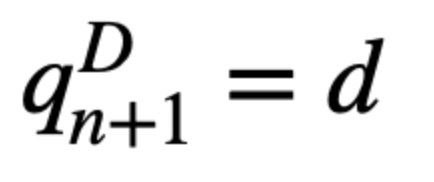
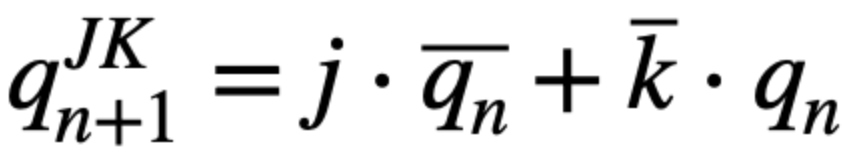
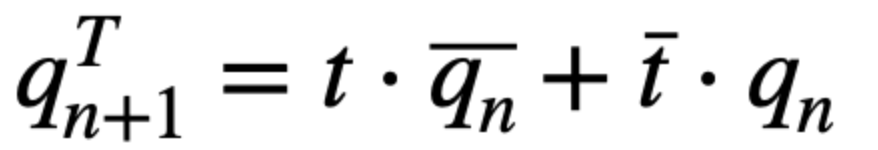

# 7-Latches and Flip-flops

## 1. Characteristic equations and tables for flip-flops.

### Tables of D, JK, T flip-flops and characteristic equations

**D flip-flop**

   | **D** | **Qn** | **Q(n+1)** | **Comments** |
   | :-: | :-: | :-: | :-- |
   | 0 | 0 | 0 | No Change |
   | 0 | 1 | 0 | Reset |
   | 1 | 0 | 1 | Set |
   | 1 | 1 | 1 | No Change |



**JK flip-flop**

   | **J** | **K** | **Qn** | **Q(n+1)** | **Comments** |
   | :-: | :-: | :-: | :-: | :-- |
   | 0 | 0 | 0 | 0 | No change |
   | 0 | 0 | 1 | 1 | No change |
   | 0 | 1 | 0 | 0 | Reset |
   | 0 | 1 | 1 | 0 | Reset |
   | 1 | 0 | 0 | 1 | Set |
   | 1 | 0 | 1 | 1 | Set |
   | 1 | 1 | 0 | 1 | Toggle |
   | 1 | 1 | 1 | 0 | Toggle |



**T flip-flop**
   
   | **T** | **Qn** | **Q(n+1)** | **Comments** |
   | :-: | :-: | :-: | :-- |
   | 0 | 0 | 0 | No change |
   | 0 | 1 | 1 | No change |
   | 1 | 0 | 1 | Invert |
   | 1 | 1 | 0 | Invert |



## 2. D Latch

**VHDL code listing of the process `p_d_latch`**
```vhdl
```

**Listing of VHDL reset and stimulus processes from the testbench `tb_d_latch.vhd` file with syntax highlighting and asserts,**
```vhdl
```

**Screenshot with simulated time waveforms**


## 3. Flip-Flops

**VHDL code listing of the processes p_d_ff_arst, p_d_ff_rst, p_jk_ff_rst, p_t_ff_rst with syntax highlighting,**
```vhdl
```

**Listing of VHDL clock, reset and stimulus processes from the testbench files with syntax highlighting and asserts,**
```vhdl
```

**Screenshot with simulated time waveforms**

## 4. Shift Register

**Image of the shift register schematic.**

