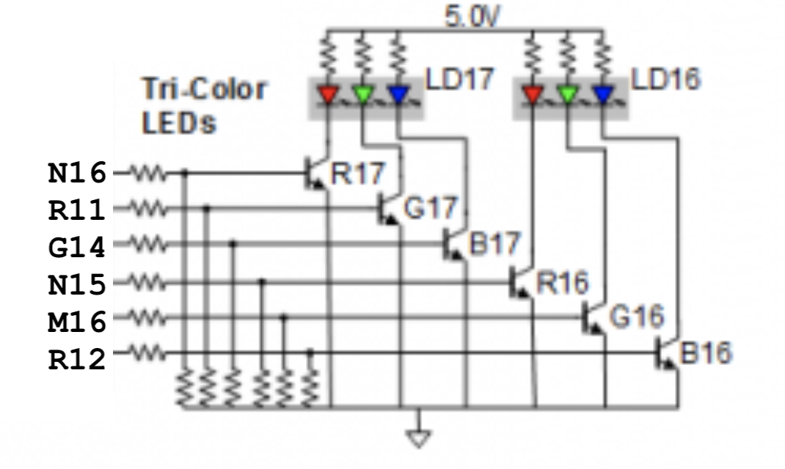
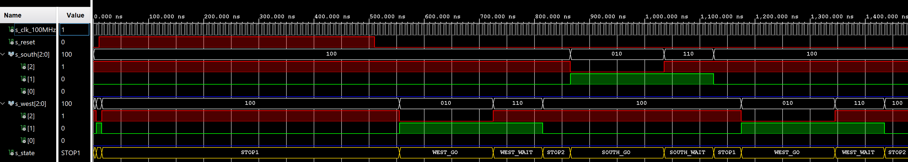

# 08-Traffic light controller

## 1. State table & RGB LEDs

### Completed state table

| **Input P** | `0` | `0` | `1` | `1` | `0` | `1` | `0` | `1` | `1` | `1` | `1` | `0` | `0` | `1` | `1` | `1` |
| :-- | :-: | :-: | :-: | :-: | :-: | :-: | :-: | :-: | :-: | :-: | :-: | :-: | :-: | :-: | :-: | :-: |
| **Clock** |  |  |  |  |  |  |  |  |  |  |  |  |  |  |  |  |
| **State** | A | A | B | C | C | D | A | B | C | D | B | B | B | C | D | B |
| **Output R** | `0` | `0` | `0` | `0` | `0` | `1` | `0` | `0` | `0` | `1` | `0` | `0` | `0` | `0` | `1` | `0` |

### Figure with connection of RGB LEDs  and completed table with color settings

**Figure with connection of RGB LEDs on Nexys A7 board**


**Completed table with color settings**

| **RGB LED** | **Artix-7 pin names** | **Red** | **Yellow** | **Green** |
| :-: | :-: | :-: | :-: | :-: |
| LD16 | N15, M16, R12 | `1,0,0` | `1,1,0` | `0,1,0` |
| LD17 | N16, R11, G14 | `1,0,0` | `1,1,0` | `0,1,0` |

## 2. Traffic light controller
### State diagram
### Listing of VHDL code of sequential process `p_traffic_fsm`
```vhdl
```
### Listing of VHDL code of combinatorial process `p_output_fsm`
```vhdl
```
### Screenshot of the simulation

## 3. Smart controller
### State table
| **Current state** | **Direction South** | **Direction West** | **Delay** | **Next State based on sensor input** |
| :-- | :-: | :-: | :-: | :-: |
| `STOP1`      | red    | red | 1 sec | Sensor = `"10"` => Next State = `SOUTH_GO`|
| `WEST_GO`    | red    | green | 4 sec | `WEST_WAIT` |
| `WEST_WAIT`  | red    | yellow | 2 sec | `STOP2` |
| `STOP2`      | red    | red | 1 sec | Sensor = `"01"` => Next State = `WEST_GO` 
Sensor = `"01"` => Next State = `WEST_GO`|
| `SOUTH_GO`   | green  | red | 4 sec | `SOUTH_WAIT` |
| `SOUTH_WAIT` | yellow | red | 2 sec | `STOP1` |
### State diagram
### Listing of VHDL code of sequential process `p_smart_traffic_fsm`
```vhdl
```
