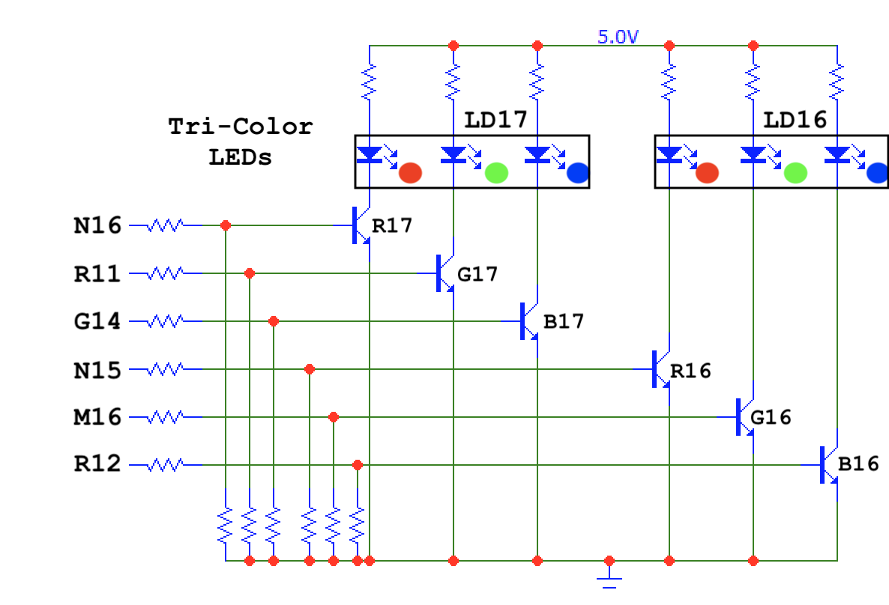
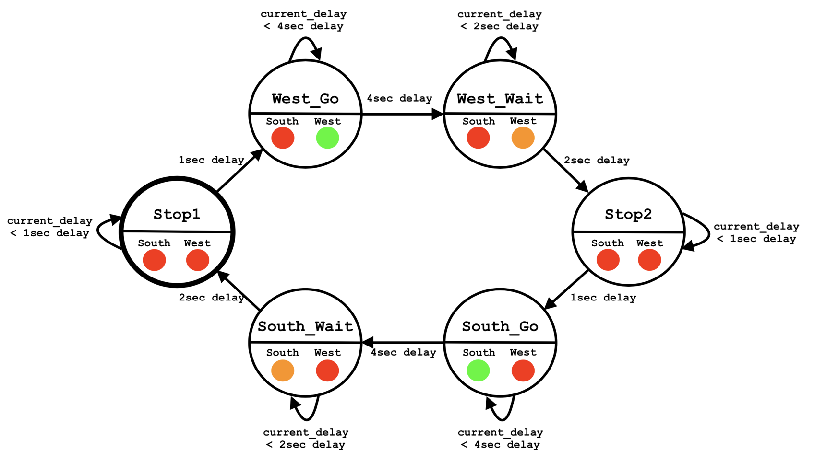
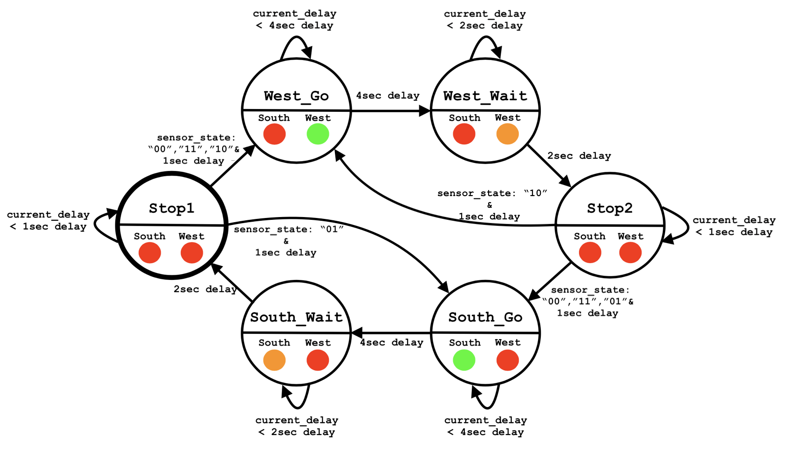

# 08-Traffic light controller

## 1. State table & RGB LEDs

### Completed state table

| **Input P** | `0` | `0` | `1` | `1` | `0` | `1` | `0` | `1` | `1` | `1` | `1` | `0` | `0` | `1` | `1` | `1` |
| :-- | :-: | :-: | :-: | :-: | :-: | :-: | :-: | :-: | :-: | :-: | :-: | :-: | :-: | :-: | :-: | :-: |
| **Clock** |  |  |  |  |  |  |  |  |  |  |  |  |  |  |  |  |
| **State** | A | A | B | C | C | D | A | B | C | D | B | B | B | C | D | B |
| **Output R** | `0` | `0` | `0` | `0` | `0` | `1` | `0` | `0` | `0` | `1` | `0` | `0` | `0` | `0` | `1` | `0` |

### Figure with connection of RGB LEDs  and completed table with color settings

**Figure with connection of RGB LEDs on Nexys A7 board**


**Completed table with color settings**

| **RGB LED** | **Artix-7 pin names** | **Red** | **Yellow** | **Green** |
| :-: | :-: | :-: | :-: | :-: |
| LD16 | N15, M16, R12 | `1,0,0` | `1,1,0` | `0,1,0` |
| LD17 | N16, R11, G14 | `1,0,0` | `1,1,0` | `0,1,0` |

## 2. Traffic light controller
### State diagram

### Listing of VHDL code of sequential process `p_traffic_fsm`
```vhdl
p_traffic_fsm : process(clk)
begin
     if rising_edge(clk) then
         if (reset = '1') then       -- Synchronous reset
             s_state <= STOP1 ;      -- Set initial state
             s_cnt   <= c_ZERO;      -- Clear all bits

         elsif (s_en = '1') then
             -- Every 250 ms, CASE checks the value of the s_state 
             -- variable and changes to the next state according 
             -- to the delay value.
             case s_state is

                 -- If the current state is STOP1, then wait 1 sec
                 -- and move to the next GO_WAIT state.
                 when STOP1 =>
                     -- Count up to c_DELAY_1SEC
                     if (s_cnt < c_DELAY_1SEC) then
                         s_cnt <= s_cnt + 1;
                     else
                         -- Move to the next state
                         s_state <= WEST_GO;
                         -- Reset local counter value
                         s_cnt   <= c_ZERO;
                     end if;

                 when WEST_GO =>
                     -- Count up to c_DELAY_1SEC
                     if (s_cnt < c_DELAY_4SEC) then
                         s_cnt <= s_cnt + 1;
                     else
                         -- Move to the next state
                         s_state <= WEST_WAIT;
                         -- Reset local counter value
                         s_cnt   <= c_ZERO;
                     end if;
                     
                 when WEST_WAIT =>
                     -- Count up to c_DELAY_1SEC
                     if (s_cnt < c_DELAY_2SEC) then
                         s_cnt <= s_cnt + 1;
                     else
                         -- Move to the next state
                         s_state <= STOP2;
                         -- Reset local counter value
                         s_cnt   <= c_ZERO;
                     end if;
                     
                 when STOP2 =>
                     -- Count up to c_DELAY_1SEC
                     if (s_cnt < c_DELAY_1SEC) then
                         s_cnt <= s_cnt + 1;
                     else
                         -- Move to the next state
                         s_state <= SOUTH_GO;
                         -- Reset local counter value
                         s_cnt   <= c_ZERO;
                     end if;
                     
                 when SOUTH_GO =>
                     -- Count up to c_DELAY_1SEC
                     if (s_cnt < c_DELAY_4SEC) then
                         s_cnt <= s_cnt + 1;
                     else
                         -- Move to the next state
                         s_state <= SOUTH_WAIT;
                         -- Reset local counter value
                         s_cnt   <= c_ZERO;
                     end if;
                     
                 when SOUTH_WAIT =>
                     -- Count up to c_DELAY_1SEC
                     if (s_cnt < c_DELAY_2SEC) then
                         s_cnt <= s_cnt + 1;
                     else
                         -- Move to the next state
                         s_state <= STOP1;
                         -- Reset local counter value
                         s_cnt   <= c_ZERO;
                     end if;

                 -- It is a good programming practice to use the 
                 -- OTHERS clause, even if all CASE choices have 
                 -- been made. 
                 when others =>
                     s_state <= STOP1;

             end case;
         end if; -- Synchronous reset
     end if; -- Rising edge
end process p_traffic_fsm;
```
### L isting of VHDL code of combinatorial process `p_output_fsm`
```vhdl
p_output_fsm : process(s_state)
begin
    case s_state is
        when STOP1 =>
            south_o <= c_RED;
            west_o  <= c_RED;
            
        when WEST_GO =>
            south_o <= c_RED;
            west_o  <= c_GREEN;
             
        when WEST_WAIT =>
            south_o <= c_RED;
            west_o  <= c_YELLOW;
                            
        when STOP2 =>
            south_o <= c_RED;
            west_o  <= c_RED;
                            
        when SOUTH_GO =>
            south_o <= c_GREEN;
            west_o  <= c_RED;
                            
        when SOUTH_WAIT =>
            south_o <= c_YELLOW;
            west_o  <= c_RED;               

        when others =>
            south_o <= c_RED;
            west_o  <= c_RED;
    end case;
end process p_output_fsm;
```
### Screenshot of the simulation

## 3. Smart controller
### State table
| **Current state** | **Direction South** | **Direction West** | **Delay** | **Next State based on sensor input** |
| :-- | :-: | :-: | :-: | :-: |
| `STOP1`      | red    | red | 1 sec | sensor_state = `"01"` => Next State = `SOUTH_GO`|
|||||sensor_state = `"00"`, `"11"` ,`"10"` => Next State = `WEST_GO`|
| `WEST_GO`    | red    | green | 4 sec | `WEST_WAIT` |
| `WEST_WAIT`  | red    | yellow | 2 sec | `STOP2` |
| `STOP2`      | red    | red | 1 sec | sensor_state = `"10"` => Next State = `WEST_GO` |
|||||sensor_state = `"00"`, `"11"` ,`"01"` => Next State = `SOUTH_GO`|
| `SOUTH_GO`   | green  | red | 4 sec | `SOUTH_WAIT` |
| `SOUTH_WAIT` | yellow | red | 2 sec | `STOP1` |
### State diagram

### Listing of VHDL code of sequential process `p_smart_traffic_fsm`
```vhdl
p_smart_traffic_fsm : process(clk)
begin
    if rising_edge(clk) then
        if (reset = '1') then       -- Synchronous reset
            s_state <= STOP1 ;      -- Set initial state
            s_cnt   <= c_ZERO;      -- Clear all bits

        elsif (s_en = '1') then
            -- Every 250 ms, CASE checks the value of the s_state 
            -- variable and changes to the next state according 
            -- to the delay value.
            case s_state is

                -- If the current state is STOP1, then wait 1 sec
                -- and move to the next GO_WAIT state.
                when STOP1 =>
                    -- Count up to c_DELAY_1SEC
                    if (s_cnt < c_DELAY_1SEC) then
                         s_cnt <= s_cnt + 1;
                    else
                        if (sensor_state = "01") then
                            s_state <= SOUTH_GO;
                        else
                            -- Move to the next state
                            s_state <= WEST_GO;
                            -- Reset local counter value
                            s_cnt   <= c_ZERO;
                        end if;
                    end if;

                when WEST_GO =>
                    -- Count up to c_DELAY_1SEC
                    if (s_cnt < c_DELAY_4SEC) then
                        s_cnt <= s_cnt + 1;
                    else
                        -- Move to the next state
                        s_state <= WEST_WAIT;
                        -- Reset local counter value
                        s_cnt   <= c_ZERO;
                    end if;
                    
                when WEST_WAIT =>
                    -- Count up to c_DELAY_1SEC
                    if (s_cnt < c_DELAY_2SEC) then
                        s_cnt <= s_cnt + 1;
                    else
                        -- Move to the next state
                        s_state <= STOP2;
                        -- Reset local counter value
                        s_cnt   <= c_ZERO;
                    end if;
                    
                when STOP2 =>
                    -- Count up to c_DELAY_1SEC

                    if (s_cnt < c_DELAY_1SEC) then
                        s_cnt <= s_cnt + 1;
                    else
                        if (sensor_state = "10") then
                            s_state <= WEST_GO;
                        else
                            -- Move to the next state
                            s_state <= SOUTH_GO;
                            -- Reset local counter value
                            s_cnt   <= c_ZERO;
                        end if;
                    end if;
                    
                when SOUTH_GO =>
                    -- Count up to c_DELAY_1SEC
                    if (s_cnt < c_DELAY_4SEC) then
                        s_cnt <= s_cnt + 1;
                    else
                        -- Move to the next state
                        s_state <= SOUTH_WAIT;
                        -- Reset local counter value
                        s_cnt   <= c_ZERO;
                    end if;
                    
                when SOUTH_WAIT =>
                    -- Count up to c_DELAY_1SEC
                    if (s_cnt < c_DELAY_2SEC) then
                        s_cnt <= s_cnt + 1;
                    else
                        -- Move to the next state
                        s_state <= STOP1;
                        -- Reset local counter value
                        s_cnt   <= c_ZERO;
                    end if;


                -- It is a good programming practice to use the 
                -- OTHERS clause, even if all CASE choices have 
                -- been made. 
                when others =>
                    s_state <= STOP1;

            end case;
        end if; -- Synchronous reset
    end if; -- Rising edge
end process p_smart_traffic_fsm;
```
