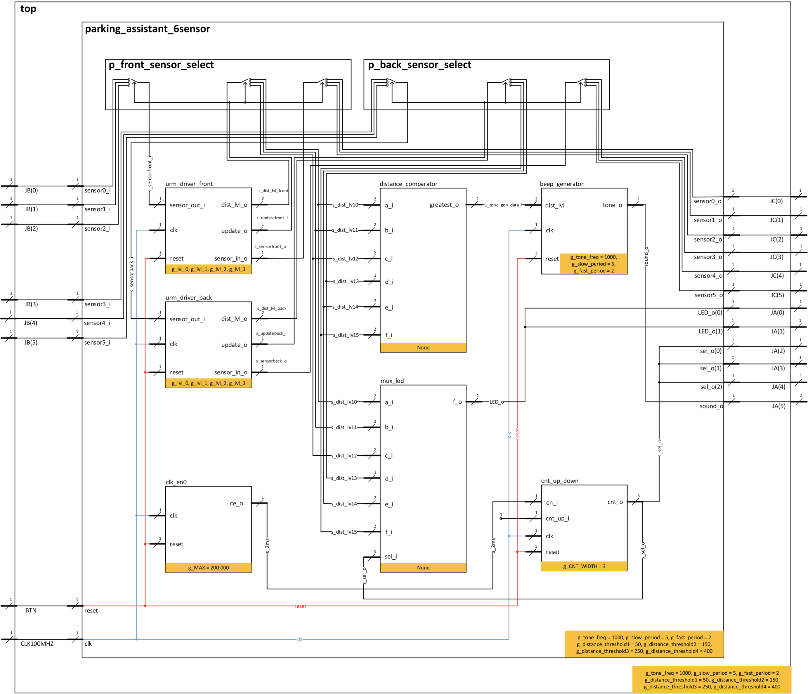
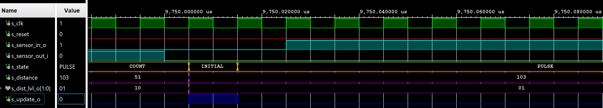

#  VHDL PROJECT - Parking assistant 

## Team members 
This project was created by Tereza Beránková, Samuel Blecha, Kryštof Buroň, Šimon Cieslar & Zuzana Czmelová

[Tereza Beránková](https://github.com/xberan49/Digital-electronics-1/tree/main/Labs/Project) - ```https://github.com/xberan49/Digital-electronics-1/tree/main/Labs/Project```


[Samuel Blecha]( https://github.com/SamuelBlecha/Digital-electronics-1/tree/main/Labs/Project) - ``` https://github.com/SamuelBlecha/Digital-electronics-1/tree/main/Labs/Project```


[Kryštof Buroň]( https://github.com/christ-0ff/Digital-Electronics-1/tree/main/Labs/project/) - ``` https://github.com/christ-0ff/Digital-Electronics-1/tree/main/Labs/project```


[Šimon Cieslar](https://github.com/SimonCieslar/Digital-electronics-1/tree/main/Labs/Project) - ``` https://github.com/SimonCieslar/Digital-electronics-1/tree/main/Labs/Project```


[Zuzana Czmelová](https://github.com/Zuzanaczm/Digital-electronics-1/tree/main/Labs/project) - ```https://github.com/Zuzanaczm/Digital-electronics-1/tree/main/Labs/project```

## Project objectives 
Our aim was to made parking assistant with HC-SR04 ultrasonic sensor, sound signaling using PWM, signaling by LED bargraph.

## Hardware description
The project is about parking assistant with 6 sensors (3 in front & 3 at the back). It measures distance in the front side and the back side - these sides measure at the same time and the sensors are switching among left, center and right side, but only one sensor works so they do not interfere each other. Distance, which is detected by each sensor, is signalized with LED bargraph. For every gained distance by sensors, there is also tone signalization that makes sound of "beep beep" when the closest target is present.


The description of hardware is pictured in the block diagram. 




If you want to see original file of this diagram, you can find Project_PS.pdf file in this project folder...

### VHDL design for parking assistant 

#### 1.Park assistant

**A)Process of VHDL design**


 This process changes internal signals connections of  `parking_assistant_6sensor` and sensors connected to it, so only one sensor detects distance at the time. We start with sensor on the left side - its input & output connects to internal signals of design source `parking_assistant_6sensor`. These internal signals are connected to `urm_driver_decoder`. After receiving an update from `urm_driver_decoder`, measured distance is saved to particular variable called s_dist_lvl that is defined for each sensor. The next state follows and the internal signals will be switched to input & output of the next sensor. Both processes ( `p_front_sensor_select` ; `p_back_sensor_select` ) work the same but independently.
 
```vhdl
 --------------------------------------------------------------------
    -- Proces for switching between Left & Center & Right front sensor
    -- So only one is measuring at the moment 
    --------------------------------------------------------------------
    p_front_sensor_select : process(clk)
    begin
        if rising_edge(clk) then
            if (reset = '1') then
                s_sensor_front <= LEFT; -- Initial state                 
            else
                case s_sensor_front is
                
                    when LEFT =>
                        s_sensorfront_i <= sensor0_i;        -- Conecting input and output of urm_driver_decoder(front)
                        sensor0_o <= s_sensorfront_o;        -- to its proper sensor input and output...
                        
                        if(s_updatefront_i = '1') then       -- Reciving update signal will...
                            s_dist_lvl0 <= s_dist_lvl_front; -- Save measured value to proper interal signal &
                            s_sensor_front <= CENTER;        -- Change state.
                        end if;                              -- Rest works same, but with its own sensors.    
                        
                    when CENTER =>                
                        s_sensorfront_i <= sensor1_i;
                        sensor1_o <= s_sensorfront_o;
    
                        if(s_updatefront_i = '1') then
                            s_dist_lvl1 <= s_dist_lvl_front;
                            s_sensor_front <= RIGHT;
                        end if;
                        
                    when RIGHT =>
                        s_sensorfront_i <= sensor2_i;
                        sensor2_o <= s_sensorfront_o;
    
                        if(s_updatefront_i = '1') then
                            s_dist_lvl2 <= s_dist_lvl_front;
                            s_sensor_front <= LEFT;
                        end if;
                        
                    when others =>-- Other states
                        s_sensor_front <= LEFT;
        
                end case;
            end if;
        end if;
    end process p_front_sensor_select;
    
    --------------------------------------------------------------------
    -- Proces for switching between Left & Center & Right back sensor
    -- So only one is measuring at the moment
    --------------------------------------------------------------------
    p_back_sensor_select : process(clk)
    begin
        if rising_edge(clk) then
            if (reset = '1') then
                s_sensor_back <= LEFT; -- Initial state       
            else
                case s_sensor_back is
                
                    when LEFT =>
                        s_sensorback_i <= sensor3_i;        -- Conecting input and output of urm_driver_decoder(back)   
                        sensor3_o <= s_sensorback_o;        -- to its proper sensor input and output...                  
    
                        if(s_updateback_i = '1') then       -- Reciving update signal will...                            
                            s_dist_lvl3 <= s_dist_lvl_back; -- Save measured value to proper interal signal &            
                            s_sensor_back <= CENTER;        -- Change state.                                             
                        end if;                             -- Rest works same, but with its own sensors.
                        
                    when CENTER =>                
                        s_sensorback_i <= sensor4_i;
                        sensor4_o <= s_sensorback_o;
    
                        if(s_updateback_i = '1') then
                            s_dist_lvl4 <= s_dist_lvl_back;
                            s_sensor_back <= RIGHT;
                        end if;
                        
                    when RIGHT =>
                        s_sensorback_i <= sensor5_i;
                        sensor5_o <= s_sensorback_o;
    
                        if(s_updateback_i = '1') then
                            s_dist_lvl5 <= s_dist_lvl_back;
                            s_sensor_back <= LEFT;
                        end if;
                        
                    when others =>-- Other states
                        s_sensor_back <= LEFT;
                        
                end case;
            end if;
        end if;
    end process p_back_sensor_select;  
 ```
 **B)VHDL design entities**
 

 There are 7 entities connected to parking assistant. We have 2 same entities `urm_driver_decoder`  and 5 single entities `distance_comparator`, `beep_generator`, ` mux_2bit_6to1`, `clock_enable`, `cnt_up_down`.
 
  ```vhdl
  --------------------------------------------------------------------
    -- Connecting entities to parking_assistant_6sensor
    --------------------------------------------------------------------
    -- Entity: Ultrasonic range meter driver - for front sensors
    uut_urm_driver_front : entity work.urm_driver_decoder
            generic map(
                g_lvl_0      => g_distance_threshold1,
                g_lvl_1      => g_distance_threshold2,
                g_lvl_2      => g_distance_threshold3,
                g_lvl_3      => g_distance_threshold4
            )
            port map(
                clk          => clk,
                reset        => reset,
                sensor_out_i => s_sensorfront_i,
                sensor_in_o  => s_sensorfront_o,
                dist_lvl_o   => s_dist_lvl_front,
                update_o     => s_updatefront_i
            );
            
    -- Entity: Ultrasonic range meter driver - for back sensors
    uut_urm_driver_back : entity work.urm_driver_decoder
            generic map(
                g_lvl_0      => g_distance_threshold1,
                g_lvl_1      => g_distance_threshold2,
                g_lvl_2      => g_distance_threshold3,
                g_lvl_3      => g_distance_threshold4
            )
            port map(
                clk          => clk,
                reset        => reset,
                sensor_out_i => s_sensorback_i,
                sensor_in_o  => s_sensorback_o,
                dist_lvl_o   => s_dist_lvl_back,
                update_o     => s_updateback_i
            );
    
    -- Entity: Comparation of distances measured by sensors        
    uut_distance_comparator : entity work.distance_comparator
            port map (
                a_i          => s_dist_lvl0,
                b_i          => s_dist_lvl1,
                c_i          => s_dist_lvl2,
                d_i          => s_dist_lvl3,
                e_i          => s_dist_lvl4,
                f_i          => s_dist_lvl5,
                greatest_o   => s_tone_gen_data_i
            );
            
     -- Entity: For tone generation dependant on closest measuerd range
    uut_tone_gen: entity work.beep_generator
            generic map(
                tone_freq    =>  g_tone_freq,  -- 1000; --Hz
                slow_period  =>  g_slow_period,  -- 5; --ms
                fast_period  =>  g_fast_period  -- 2  --ms
            )  
            port map  (
                clk          =>  clk,
                reset        =>  reset,
                dist_lvl     =>  s_tone_gen_data_i,
                tone_o       =>  sound_o
            );
    
    -- Entity: Multiplexer for 6-LEDs(bargraphs)      
    uut_mux_led: entity work.mux_2bit_6to1
            port map (
                a_i          =>  s_dist_lvl0, 
                b_i          =>  s_dist_lvl1, 
                c_i          =>  s_dist_lvl2, 
                d_i          =>  s_dist_lvl3, 
                e_i          =>  s_dist_lvl4, 
                f_i          =>  s_dist_lvl5, 
                sel_i        =>  s_sel_o,
                f_o          =>  LED_o
            );
            
    -- Entity: For sending pulse every 2ms
    uut_clk_en0 : entity work.clock_enable
            generic map(
                g_MAX        => 200000
            )
            port map(
                clk          => clk,
                reset        => reset,
                ce_o         => s_2ms
            );   
                 
    -- Entity: To change multiplexer selector signal
    uut_bin_cnt0 : entity work.cnt_up_down
            generic map(
                g_CNT_WIDTH  => 3
            )
            port map(
                clk          => clk,
                reset        => reset,
                en_i         => s_2ms,
                cnt_up_i     => '1',
                cnt_o        => s_sel_o            
            );             
                -- Connecting internal mux selecting singal to output          
                sel_o <= s_sel_o;
                           
end Behavioral;
 ```
 
**C)Testbench for parking assistant** 
 
 
 There are 3 processes in testbench - `p_clk_gen` with frequency of 100MHz ,  `p_reset_gen` , `p_stimulus` . Function of processes are displayed in simulations below.
 
  ```vhdl
  --------------------------------------------------------------------
    -- Clock generation process
    --------------------------------------------------------------------
    p_clk_gen : process
    begin
        while now < 100 ms loop         
            s_clk <= '0';
            wait for c_CLK_100MHZ_PERIOD / 2;
            s_clk <= '1';
            wait for c_CLK_100MHZ_PERIOD / 2;
        end loop;
        wait;   
    end process p_clk_gen;
    
    --------------------------------------------------------------------
    -- Reset generation process
    --------------------------------------------------------------------
    p_reset_gen : process
    begin
       
        -- Initial reset activated
        s_reset <= '1';
        wait for 100 us;
    
        -- Reset deactivated
        s_reset <= '0';
        wait for 3 ms;
        
        -- Reset activated
        s_reset <= '1';
        wait for 100 us;
    
        -- Reset deactivated
        s_reset <= '0';
    
        wait;
    end process p_reset_gen;
    
    --------------------------------------------------------------------
    -- Data generation process
    --------------------------------------------------------------------
    p_stimulus : process
    begin
        report "Stimulus process started" severity note;
        
       --                     --1st block 
        wait for 180 us;
        s_sensor0_out_i <= '1';
        s_sensor3_out_i <= '1';
        wait for c_dist_0;
        s_sensor0_out_i <= '0';
        s_sensor3_out_i <= '0';
        
        wait for 180 us;        
        s_sensor1_out_i <= '1';
        s_sensor4_out_i <= '1'; 
        wait for c_dist_0;      
        s_sensor1_out_i <= '0';
        s_sensor4_out_i <= '0'; 
        
        wait for 100 us;
        s_sensor2_out_i <= '1';
        s_sensor5_out_i <= '1';
        wait for c_dist_0;
        s_sensor2_out_i <= '0';
        s_sensor5_out_i <= '0';
       --                     --2nd block                     
        wait for 180 us;
        s_sensor0_out_i <= '1';
        s_sensor3_out_i <= '1';
        wait for c_dist_4;
        s_sensor0_out_i <= '0';
        s_sensor3_out_i <= '0';
        
        wait for 180 us;        
        s_sensor1_out_i <= '1';
        s_sensor4_out_i <= '1'; 
        wait for c_dist_2;      
        s_sensor1_out_i <= '0';
        s_sensor4_out_i <= '0'; 
        
        wait for 100 us;
        s_sensor2_out_i <= '1';
        s_sensor5_out_i <= '1';
        wait for c_dist_3;
        s_sensor2_out_i <= '0';
        s_sensor5_out_i <= '0'; 
       --                     --3rd block                       
        wait for 180 us;
        s_sensor0_out_i <= '1';
        s_sensor3_out_i <= '1';
        wait for c_dist_3;
        s_sensor0_out_i <= '0';
        s_sensor3_out_i <= '0';
        
        wait for 180 us;        
        s_sensor1_out_i <= '1';
        s_sensor4_out_i <= '1'; 
        wait for c_dist_2;      
        s_sensor1_out_i <= '0';
        s_sensor4_out_i <= '0'; 
        
        wait for 100 us;
        s_sensor2_out_i <= '1';
        s_sensor5_out_i <= '1';
        wait for c_dist_4;
        s_sensor2_out_i <= '0';
        s_sensor5_out_i <= '0';
       --                     --4th block
        wait for 15 us;
        s_sensor0_out_i <= '1';
        s_sensor3_out_i <= '1';
        wait for c_dist_5;
        s_sensor0_out_i <= '0';
        s_sensor3_out_i <= '0';
       
        wait for 11 us;
        s_sensor1_out_i <= '1';
        s_sensor4_out_i <= '1';
        wait for c_dist_5;
        s_sensor1_out_i <= '0'; 
        s_sensor4_out_i <= '0';
        
        wait for 130 us;
        s_sensor2_out_i <= '1';
        s_sensor5_out_i <= '1';
        wait for c_dist_5;
        s_sensor2_out_i <= '0';
        s_sensor5_out_i <= '0';

        report "Stimulus process finished" severity note;
        wait;
    end process p_stimulus;
  ```    
  
 **D)Screenshots of simulation** 
 
 In the first picture we can see the whole simulation. The signals with shades of blue are for front side, with shades of light brown are for back side, red signals represent updating internal signals that change state , green s_tone signals represent sound output, green s_state signal is internal signal of URM driver decoder and on last 2 green signals we can see LED output. Signals s_sensor_in_o are sending 10us pulses to sensors and s_sensor_out_i are receiving returning signals. From a short look we can tell that it works properly. The second and third picture is zoomed image of the first picture. The 1st zoomed area is marked with first violet vertical line and the 2nd zoomed area is marked with second violet vertical line. Signals s_sensor2_out_i and s_sensor5_out_i in this highlighted area are 5000us long, signals s_sensor1_out_i and s_sensor4_out_i are 3000us long. We will take a look at the zoomed pictures.
 
 
 
 In the picture we can see ends of s_sensor1_out_i and s_sensor4_out_i signals which are 3000us long. After these signals change the state to 0, the update is triggered, every state changes to its right following position and the measured distance is saved to its proper value s_dist_lvl1 and s_dist_lvl4. With calculation we can check that 3000us long signal corresponds to 51cm which is above first treshold and this value is represented by `10` . After all that URM driver decoder sends 10us pulse into 2 following sensors and then waits for returning signal. At the end of this picture we can see returning signals (s_sensor2_out_i and s_sensor5_out_i)  and we will take a look on the ends of these signals in the next picture.
 
 
  
  In this picture it works the same like in simulation above but with s_sensor2_out_i and s_sensor5_out_i signals.The length of these signals are 5000us and it corresponds to 86cm which is again above first treshold and this value is represented by `10`. 
  
 
   
   This is close look on the update when it is triggered. And we can see that it works properly - it changes states to right positions.
   
 

#### Submodules of parking assistant :

#### 2.URM (ultrasonic range meter) driver decoder 
**A)VHDL design of URM driver decoder** 

  Process for URM driver decoder. URM driver decoder communicates with each sensor separately. It sends 10us pulses, then waits for pulses coming back from the sensor. When it comes , it counts its length. After that, it assignes one of four tresholds to the output length measured. 

  ``` vhdl
   --------------------------------------------------------------------
    -- Process for sending 10us signal into a sensor & 
    -- For measuring returning signal
    --------------------------------------------------------------------
    p_distance_measurement : process(clk)
    begin
        if rising_edge(clk) then
            if (reset = '1') then         -- Synchronous reset
                s_state       <= INITIAL; -- Set initial state
                s_local_cnt   <= 0;       -- Clear all counters
                update_o      <= '0';     -- Reset update signal
                sensor_in_o   <= '0';     -- Reset sensor input
                s_distance    <= 201;     -- Initialize distance
            else
                case s_state is  
                              
                    when INITIAL =>-- Initial state                                              
                        if (reset = '0') then
                            s_state         <= PULSE;     
                            update_o <= '0';-- Setting mux update to 0                        
                        end if;
                        
                    when PULSE =>-- State for sending 10us pulse     
                        if (s_local_cnt >= (PULSE_LENGTH - 1)) then
                            s_local_cnt     <= 0;        -- Clear counter
                            sensor_in_o     <= '0';      -- Reset output
                            s_state         <= WAITING;  -- Next state
                        else -- 10 us counter
                            s_local_cnt     <= s_local_cnt + 1; 
                            sensor_in_o     <= '1';      
                        end if;
                        
                    when WAITING =>-- Waiting state for signal returning from sensor
                        if (sensor_out_i = '1') then 
                            s_state         <= COUNT; 
                        end if;
                        
                    when COUNT =>-- State for counting the length of returning signal
                        if (sensor_out_i = '1') then -- Counter
                            s_local_cnt     <= s_local_cnt + 1;
                        else -- Dividing s_distance(length) of measured signal by constant 100*58                           
                            s_distance      <= s_local_cnt /5800;    -- specified by datasheet & 
                            s_local_cnt     <= 0;                    -- to eliminate efect of clk
                            update_o        <='1';                   -- to get dist in cm.          
                            s_state         <= INITIAL;             
                        end if;                           
                      
                    when others =>-- Other states
                        s_state <= INITIAL;
        
                end case;
            end if; 
        end if; 
    end process p_distance_measurement;
    
    --------------------------------------------------------------------
    -- Process for quantization measured signal
    --------------------------------------------------------------------
    p_dist_decoder : process(s_distance)
    begin
        if   (s_distance <= g_lvl_0) then -- The closest distance
            dist_lvl_o <= "11";
        elsif(s_distance <= g_lvl_1) then
            dist_lvl_o <= "10";
        elsif(s_distance <= g_lvl_2) then
            dist_lvl_o <= "01";
        else                              -- The furthest distance
            dist_lvl_o <= "00";
        end if;           
    end process p_dist_decoder;
  ```   
  
  **B)Testbench**
  
  In testbench we simulate signals which are coming back.
  
  ```vhdl
      --------------------------------------------------------------------
    -- Clock generation process
    --------------------------------------------------------------------
    p_clk_gen : process
    begin
        while now < 750 ms loop         
            s_clk <= '0';
            wait for c_CLK_100MHZ_PERIOD / 2;
            s_clk <= '1';
            wait for c_CLK_100MHZ_PERIOD / 2;
        end loop;
        wait;                           -- Process is suspended forever
    end process p_clk_gen;
    
    --------------------------------------------------------------------
    -- Reset generation process
    --------------------------------------------------------------------
    p_reset_gen : process
    begin
       
        --Initial reset activated
        s_reset <= '1';
        wait for 100 us;
    
        -- Reset deactivated
        s_reset <= '0';
    
        wait;
    end process p_reset_gen;
    
    --------------------------------------------------------------------
    -- Data generation process
    --------------------------------------------------------------------
    p_stimulus : process
    begin
        report "Stimulus process started" severity note;
        wait for 500 us;              -- Waiting for inital pulse
            s_sensor_out_i <= '1';
        wait for 150 us;              -- "Reciving" distance lesser than lvl_0 distance
            s_sensor_out_i <= '0';    -- its length is 2.58 cm (150/58)
        wait for 50 us;               -- Waiting for sending 10us pulse (We have to wait
            s_sensor_out_i <= '1';    -- at least 10us. Here we wait 50us to be sure.)
        wait for 3000 us;             -- "Reciving" distance bigger than lvl_0 distance 
            s_sensor_out_i <= '0';    -- its length is 51.8 cm (3000/58)
        wait for 50 us;               -- Waiting for sending 10us pulse
            s_sensor_out_i <= '1';
        wait for 6000 us;             -- "Reciving" distance bigger than lvl_1 distance 
            s_sensor_out_i <= '0';    -- its length is 103.4 cm (6000/58)
        wait for 50 us;               -- Waiting for sending 10us pulse
            s_sensor_out_i <= '1';
        wait for 12000 us;            -- "Reciving" distance bigger than lvl_2 distance 
            s_sensor_out_i <= '0';    -- its length is 206.9 cm (12000/58)
        wait for 50 us;               -- Waiting for sending 10us pulse
            s_sensor_out_i <= '1';
        wait for 24000 us;            -- "Reciving" distance bigger than lvl_2 distance
            s_sensor_out_i <= '0';    -- its length is 413.8 cm (24000/58)
        wait for 50 us;
        report "Stimulus process finished" severity note;
        wait;
    end process p_stimulus;
``` 
**C) Screenshots of simulation**


The first picture is a look on the whole simulation which is 50ms long. Again from a short look we can see that it works properly. 


In the zoomed picture we can find the ending of returning signal which is then added to s_dist_lvl_o. After that the update is triggered and the new cycle starts again.


Here we can see the beginning of this simulation when the reset is on (it is in value of 1). When the reset is in value of 0 then the whole cycle starts ( Initial --> Pulse -->  Waiting --> Count --> Initial...).


Here we can see the proper function of update. 




#### 3.Beep generator 
**A)VHDL design**

This process describes changing frequency of the tone based on distance change. When the distance is shortest the sound creates continuos tone, the second shortest distance generates fast beeping. The bigger is distance , the slower are sounds of beeping. We can hear nothing when the distance is too far. 

``` vhdl
 --------------------------------------------------------------------
    -- Process for changing frequency of the tone
    --------------------------------------------------------------------
    p_pulse_clock : process(pulse_clock_period,clk)  -- Generates signal, which determines the     
    begin                                            -- frequency of beeping.
        if (rising_edge(clk)) then
            if (s_pulse_counter < 100000*pulse_clock_period) then
                s_pulse_counter <= s_pulse_counter +1;
            else
                pc_out <= not pc_out;
                s_pulse_counter <= 0;                         
            end if;
        end if;
    end process p_pulse_clock;
    
    --------------------------------------------------------------------
    -- Process for changing frequency of tone depending on the input
    --------------------------------------------------------------------
    p_clock_enable : process(dist_lvl,clk)
    begin
        case dist_lvl is
            when "11" =>                            -- Shortest distance => continuous tone.
                s_en <= '1';                        -- Tone generator output enabled
            when "10" =>                            -- Second shortest distance => fast beeping
                pulse_clock_period <= fast_period;  -- Pulse clock generates fast beeping signal
                s_en  <= pc_out;                    -- Enables tone generator output with the frequencz of pulse clock
            when "01" =>                            -- Second longest distance => slow beeping
                pulse_clock_period <= slow_period;  -- Pulse clock generates slow beeping signal
                s_en  <= pc_out;                    -- Enables tone generator output with the frequencz of pulse clock
            when others =>                          -- Farthest distance => silence
                s_en <= '0';                        -- Tone generator output off
        end case;
    end process p_clock_enable;
    
    --------------------------------------------------------------------
    -- Tone generating process
    --------------------------------------------------------------------
    p_1kHz_gen : process(clk, s_en)                 -- Tone generator
    begin        
        if rising_edge(clk) then        
            if (reset = '1') then
                s_clk_counter   <= 0;
                s_local_clock   <= '0';
                tone_o          <= '0';
            elsif (s_clk_counter >= ((s_clk_period-1)/2 )) then
                s_clk_counter   <= 0;
                s_local_clock   <= not s_local_clock;
            else
                s_clk_counter   <= s_clk_counter + 1;
            end if;           
        end if;
           
        if (s_en = '1') then
            tone_o <= s_local_clock;   -- Enables tone gen. output 
        else
            tone_o <= '0';
        end if;
    end process p_1kHz_gen;

``` 
**B)Testbench**
```vhdl
 --------------------------------------------------------------------
    -- Reset generation process
    --------------------------------------------------------------------    
    p_clk_gen : process
    begin
        while now < 50 ms loop
            s_clk_100MHz <= '0';
            wait for c_CLK_100MHZ_PERIOD / 2;
            s_clk_100MHz <= '1';
            wait for c_CLK_100MHZ_PERIOD / 2;
        end loop;
        wait;
    end process p_clk_gen;
    
    --------------------------------------------------------------------
    -- Data generation process
    --------------------------------------------------------------------
    p_stimulus : process
    begin
        report "Stimulus process started" severity note;
        
            distance_lvl <= "00";
            wait for 10ms;
            distance_lvl <= "01";
            wait for 10ms;
            distance_lvl <= "10";
            wait for 10ms;
            distance_lvl <= "11";
            
        report "Stimulus process finished" severity note;
        wait;
    end process p_stimulus;
   ``` 
   
**C) Screenshot of simulation**


When the distance changes period of beeping signal is changed. As displayed on simulation below


#### 4. Distance comparator 

This entity compares measured distances, and returns the closest distance measured - in our project it its defined that in bit it means that it is the highest value.

**A)VHDL design**
  ```vhdl
 --------------------------------------------------------------------
    -- Process for finding highest value
    --------------------------------------------------------------------
    p_comp : process(a_i,b_i,c_i,d_i,e_i,f_i,temp_1,temp_2,temp_3,temp_4)
    begin
        -- Finding the highest value from input signals, saving them into temporary signals
        if (b_i >= a_i) then  
            temp_1 <= b_i;
        else
            temp_1 <= a_i;
        end if;
        
        if (c_i >= d_i) then
            temp_2 <= c_i;
        else
            temp_2 <= d_i;
        end if;
        
        if (e_i >= f_i) then
            temp_3 <= e_i;
        else
            temp_3 <= f_i;
        end if;
        
        -- Finding the highest value of the temporary signals.
        if (temp_1 >= temp_2) then
            temp_4 <= temp_1;
        else
            temp_4 <= temp_2;
        end if;
        
        -- Greatest value sent to output.
        if (temp_4 >= temp_3) then
            greatest_o <= temp_4;
        else
            greatest_o <= temp_3;
        end if;
    end process p_comp;
  ```  
  **B) Testbench**
  ```vhdl
   -- Connecting testbench signals with distance_comparator
    uut_distance_comparator : entity work.distance_comparator
        port map(
            a_i           => s_a,
            b_i           => s_b,
            c_i           => s_c,
            d_i           => s_d,
            e_i           => s_e,
            f_i           => s_f,
            greatest_o    => s_goat
        );
    --------------------------------------------------------------------
    -- Data generation process
    --------------------------------------------------------------------
    p_stimulus : process
    begin        
        report "Stimulus process started" severity note;
        s_a <= "01";
        s_b <= "00";
        s_c <= "00";
        s_d <= "00";
        s_e <= "00";
        s_f <= "00";
        wait for 10ns;
        
        s_a <= "00";
        s_b <= "01";
        s_c <= "00";
        s_d <= "00";
        s_e <= "00";
        s_f <= "00";
        wait for 10ns;
        
        s_a <= "00";
        s_b <= "00";
        s_c <= "01";
        s_d <= "00";
        s_e <= "00";
        s_f <= "00";
        wait for 10ns;
        
        s_a <= "00";
        s_b <= "00";
        s_c <= "00";
        s_d <= "01";
        s_e <= "00";
        s_f <= "00";
        wait for 10ns;
        
        s_a <= "00";
        s_b <= "00";
        s_c <= "00";
        s_d <= "01";
        s_e <= "00";
        s_f <= "00";
        wait for 10ns;
        
        s_a <= "00";
        s_b <= "00";
        s_c <= "00";
        s_d <= "00";
        s_e <= "01";
        s_f <= "00";
        wait for 10ns;
        
        s_a <= "00";
        s_b <= "00";
        s_c <= "00";
        s_d <= "00";
        s_e <= "00";
        s_f <= "01";
        wait for 10ns;
        
        s_a <= "11";
        s_b <= "11";
        s_c <= "00";
        s_d <= "00";
        s_e <= "00";
        s_f <= "01";
        wait for 10ns;
        wait;
    end process p_stimulus;
   ``` 
  **C) Screenshot of simulation**
  
  On the image below we can see that input values can be different but the entity always return one, that is greatest = s_goat.
  
  
  
#### 5. cnt_up_down 

One of the two entities that were made in school. It works the same but it was a bit modified. It only counts to value b"101" - 5 and then it resets itself.


**A) VDHL design**
```vhdl
--------------------------------------------------------------------
    -- p_cnt_up_down:
    -- Clocked process with synchronous reset which implements n-bit 
    -- up/down counter.
    --------------------------------------------------------------------
    p_cnt_up_down : process(clk)
    begin
        if rising_edge(clk) then
        
            if (reset = '1') then               -- Synchronous reset
                s_cnt_local <= (others => '0'); -- Clear all bits

            elsif (en_i = '1') then       -- Test if counter is enabled
                if (cnt_up_i = '1') then
                    if (s_cnt_local >= b"101") then     -- Counter Shortened to 6 values
                        s_cnt_local <= b"000";
                    else
                        s_cnt_local <= s_cnt_local + 1;
                    end if;                    
                else
                    s_cnt_local <= s_cnt_local - 1;
                end if;
            end if;
        end if;
    end process p_cnt_up_down;

    -- Output must be retyped from "unsigned" to "std_logic_vector"
    cnt_o <= std_logic_vector(s_cnt_local);
   ```
   **B)Testbench**
   
   ```vhdl
    --------------------------------------------------------------------
    -- Clock generation process
    --------------------------------------------------------------------
    p_clk_gen : process
    begin
        while now < 750 ns loop         -- 75 periods of 100MHz clock
            s_clk_100MHz <= '0';
            wait for c_CLK_100MHZ_PERIOD / 2;
            s_clk_100MHz <= '1';
            wait for c_CLK_100MHZ_PERIOD / 2;
        end loop;
        wait;
    end process p_clk_gen;

    --------------------------------------------------------------------
    -- Reset generation process
    --------------------------------------------------------------------
    p_reset_gen : process
    begin
        
        -- Reset activated
        s_reset <= '1';
        wait for 50 ns;

        s_reset <= '0';
        wait;
    end process p_reset_gen;

    --------------------------------------------------------------------
    -- Data generation process
    --------------------------------------------------------------------
    p_stimulus : process
    begin
        report "Stimulus process started" severity note;

        -- Enable counting
        s_en     <= '1';
        s_cnt_up <= '1';
        wait for 380 ns;
        -- Disable counting
        s_en     <= '0';

        report "Stimulus process finished" severity note;
        wait;
    end process p_stimulus;
  ```
   
 

**C)Screenshot of simulation**


On this simulation image we can see that it counts properly, when the enabling (s_en) signal is positive, from zero to number five, and then it resets itself. 

 
  
#### 6. mux_2bit_6to1

We use this VHDL design from entity which we made at seminar at school but it was also a little bit modified.

**A)VHDL design**
 ```vhdl
architecture Behavioral of mux_2bit_6to1 is

begin
       f_o <= a_i when (sel_i = "000") else
              b_i when (sel_i = "001") else
              c_i when (sel_i = "010") else
              d_i when (sel_i = "011") else
              e_i when (sel_i = "100") else
              f_i;                 

end Behavioral;
 ```
 
**B)Testbench**
 ```vhdl
--------------------------------------------------------------------
    -- Data generation process
    --------------------------------------------------------------------
    p_stimulus : process
    begin        
        report "Stimulus process started" severity note;
        s_a <= "00";
        s_b <= "01";
        s_c <= "10";
        s_d <= "11";
        s_e <= "00";
        s_f <= "01";
        
        s_sel <= "000";
        wait for 10ns;        
        s_sel <= "001";
        wait for 10ns;
        s_sel <= "010";
        wait for 10ns;        
        s_sel <= "011";
        wait for 10ns;
        s_sel <= "100";
        wait for 10ns;        
        s_sel <= "101";
        
        wait;
    end process p_stimulus;
  ```
**C)Screenshot of simulation**


## TOP module description and simulations


TOP module is designed for connecting code signal to pins of `Arty-A7-100` but it is same as the parking assistant.

**A)VHDL design**
```vhdl
 -- Connecting testbench signals with beep_generator
    uut_parking_assistant : entity work.parking_assistant_6sensor
    generic map(     
    
        -- Optionable constants  
        g_tone_freq    => 1000,
        g_slow_period  => 5,
        g_fast_period  => 2,
        
        -- Thresholds of measured distances
        g_distance_threshold1  =>  50,
        g_distance_threshold2  =>  150,
        g_distance_threshold3  =>  250,
        g_distance_threshold4  =>  400
    )
    port map  (
         -- Clk & Reset signal
        clk        =>  CLK100MHZ,
        reset      =>  BTN(0),
        
        -- Inputs from sensors            
        sensor0_i  =>  JB(0),
        sensor1_i  =>  JB(1),
        sensor2_i  =>  JB(2),
        sensor3_i  =>  JB(3),
        sensor4_i  =>  JB(4),
        sensor5_i  =>  JB(5),
        
        -- Outputs to sensors              
        sensor0_o  =>  JC(0),
        sensor1_o  =>  JC(1),
        sensor2_o  =>  JC(2),
        sensor3_o  =>  JC(3),
        sensor4_o  =>  JC(4),
        sensor5_o  =>  JC(5),
         
        -- LEDs output & and their mux selector output            
        LED_o(0)   =>  JA(0),
        LED_o(1)   =>  JA(1),
        sel_o(0)   =>  JA(2),
        sel_o(1)   =>  JA(3),
        sel_o(2)   =>  JA(4),
                       
        -- Sound output
        sound_o    =>  JA(5)
    );
   ```
   
## Logical circuit to decode LED outputs

These selecting signal sel_i are switching between individual bargraphs and signals LED_o determine which LEDs will be on.  We will connect output pins of our board to this logical function. 


In this picture there is LED realization of bargraphs . We can connect it to our logical circuit and it will signalize the measured level


## Video

[Link to video](https://drive.google.com/file/d/1e4VpybgQU2BDK1-Zx1SL0CHvPuiHs9Gq/view?usp=sharing) - ```https://drive.google.com/file/d/1e4VpybgQU2BDK1-Zx1SL0CHvPuiHs9Gq/view?usp=sharing```

## References


We used this reference manual to find out how the sensors work...


[Reference manual](https://www.gie.com.my/download/um/modules/sensor/um_hc_sr04.pdf) - ```https://www.gie.com.my/download/um/modules/sensor/um_hc_sr04.pdf```


And to be sure we watched first few minutes of this video where the man explains how to sensor work in details.


[Explaining ultrasonic sensor](https://www.youtube.com/watch?v=6F1B_N6LuKw&t=100s) - ```https://www.youtube.com/watch?v=6F1B_N6LuKw&t=100s```

